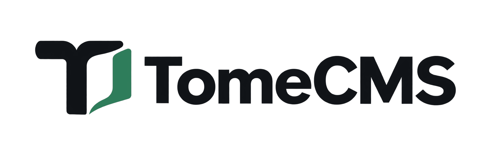
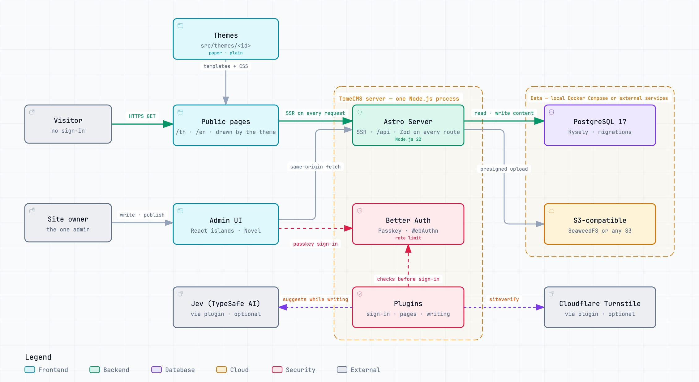

<h1 align="center">
  <picture>
    <source media="(prefers-color-scheme: dark)" srcset="public/brand/tomecms-logo-reverse.png">
    
  </picture>
</h1>

TomeCMS is a lightweight CMS for sites in Thai and English, built with Astro. It ships a server-rendered blog and a React admin editor, and serves the same published content through a versioned headless REST API.

> **Status:** the package is `0.11.0`, and there is no production `v1.0.0` release yet. Today's install is a pre-1.0 preview: a 0.x site is upgraded in place, and moving it to a managed `1.0.0` install will need a fresh server. The managed `1.0.0` updater and its disposable operation harness are implemented. The production dependency audit reports no advisory at all. The integration, browser and operations gates run green against Astro 7. Two gates stay open because they need infrastructure this repository cannot stand up for itself: verifying a public, immutable release and its attestations, and accepting a real HTTPS VPS on `amd64` and `arm64`. [Releases and changes](https://dhanabhon.github.io/tome-cms/contributing/releases/) on the documentation site says where each version's notes are kept, and the [changelog](CHANGELOG.md) sums up every version in one place.

## Architecture

<picture>
  <source media="(prefers-color-scheme: dark)" srcset="docs/tome-cms-overview.en.dark.png">
  
</picture>

One Node.js process serves the public pages, the admin and both APIs, and PostgreSQL and the object store hold everything that lasts. [docs/tome-cms-overview.en.html](docs/tome-cms-overview.en.html) is the same diagram to explore, with a guided view of each path through it: download it and open it in a browser. A Thai edition sits beside it.

## Documentation

Everything else about TomeCMS is on its documentation site, in English at [dhanabhon.github.io/tome-cms](https://dhanabhon.github.io/tome-cms/) and in Thai at [dhanabhon.github.io/tome-cms/th](https://dhanabhon.github.io/tome-cms/th/).

| English | Thai | What it covers |
| --- | --- | --- |
| [Start here](https://dhanabhon.github.io/tome-cms/start/what-is-tomecms/) | [เริ่มต้นที่นี่](https://dhanabhon.github.io/tome-cms/th/start/what-is-tomecms/) | What TomeCMS is, and how to install it on a server of your own |
| [Running a site](https://dhanabhon.github.io/tome-cms/running/configuration/) | [ดูแลเว็บไซต์](https://dhanabhon.github.io/tome-cms/th/running/configuration/) | Configuration, updates, backups, and getting back in when you are locked out |
| [Using the admin](https://dhanabhon.github.io/tome-cms/admin/writing/) | [ใช้งานหน้าผู้ดูแล](https://dhanabhon.github.io/tome-cms/th/admin/writing/) | Each screen of the admin with a picture of it, from writing a post to reading the stats |
| [Plugins](https://dhanabhon.github.io/tome-cms/plugins/turnstile/) | [ปลั๊กอิน](https://dhanabhon.github.io/tome-cms/th/plugins/turnstile/) | What each plugin that ships with TomeCMS does, and how to switch it on |
| [Headless API](https://dhanabhon.github.io/tome-cms/api/overview/) | [Headless API](https://dhanabhon.github.io/tome-cms/th/api/overview/) | Read published content over HTTP, with a reference generated from the app's OpenAPI document |
| [Extending](https://dhanabhon.github.io/tome-cms/extending/themes/) | [ต่อยอด](https://dhanabhon.github.io/tome-cms/th/extending/themes/) | Write a theme or a plugin for TomeCMS |
| [Contributing](https://dhanabhon.github.io/tome-cms/contributing/setup/) | [ร่วมพัฒนา](https://dhanabhon.github.io/tome-cms/th/contributing/setup/) | Set up the code on your own computer, and send a change back |

## Contributing and security

To send a change, read [CONTRIBUTING.md](CONTRIBUTING.md). To report a vulnerability, read [SECURITY.md](SECURITY.md), and never open an issue for it.

## License

TomeCMS is released under the [MIT License](LICENSE). The release images carry the DB-IP Lite country database, [IP Geolocation by DB-IP](https://db-ip.com), under CC BY 4.0.
