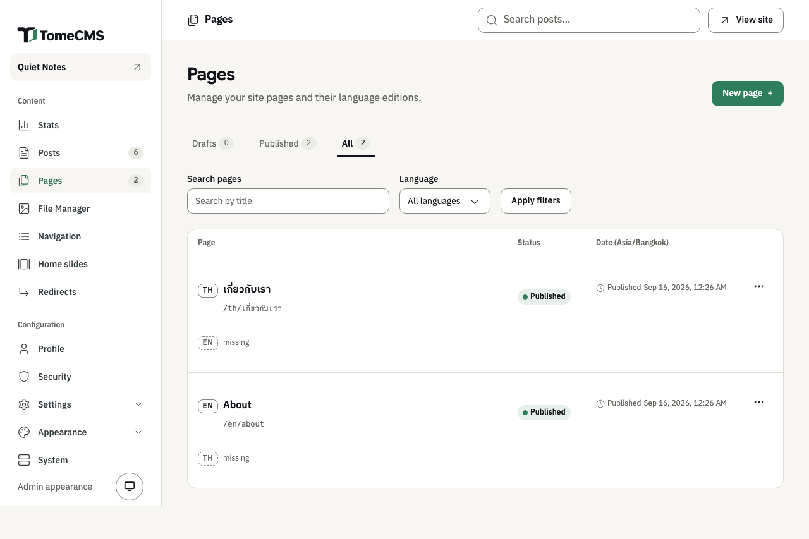
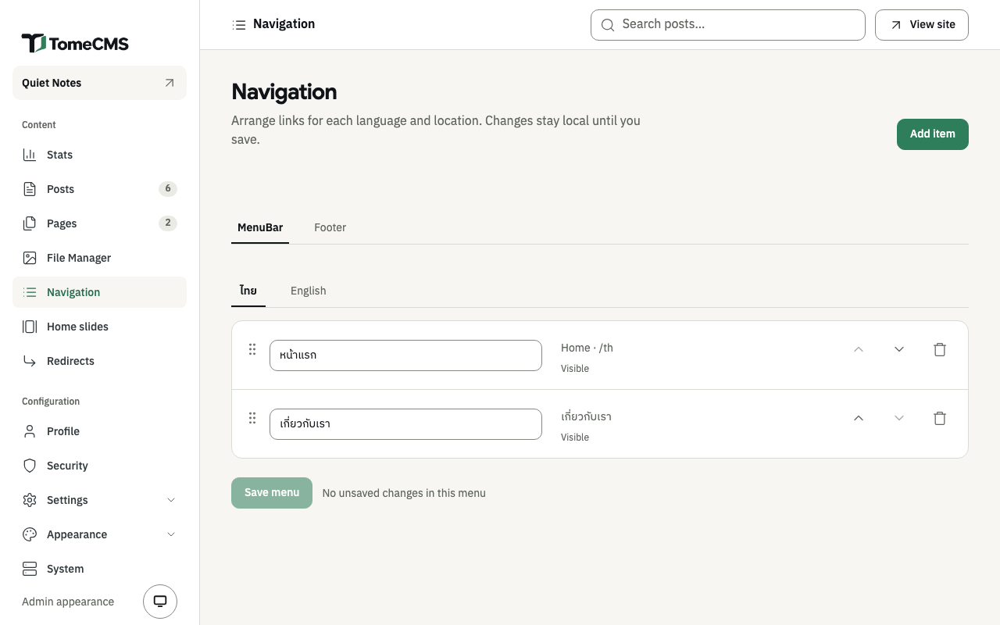

"Pages", under "Content", holds the pages that stand apart from the blog, such as an About page. A page is not listed on the home page the way a post is. Readers reach it through a link, usually one in a menu, and "Navigation" is where you arrange the menus.

## The list of pages

Each row is one page, with a line for every language edition you have written, its address, its status and its date in the site's time zone. The tabs "Drafts", "Published" and "All" work as they do for posts. "Search pages" finds a page by its title, and "Language" narrows the list once you press "Apply filters".

The "..." beside an edition has "Edit", "Preview", "Duplicate", "Publish" or "Unpublish", and "Delete". Deleting an edition takes it out of every menu too, and cannot be undone. "missing" starts the page in the other language.

## Writing a page

"New page" opens the editor in the site's default language. It is the post editor, with the same blocks, pictures, files and formatting, and [Writing](/tome-cms/admin/writing/) describes them. Its bar has "Back to Pages", and a page publishes the way a post does, as [Publishing](/tome-cms/admin/publishing/) describes.

A page has no categories and no cover picture. "Settings" opens "Page settings":

| Field | What it does |
| --- | --- |
| "Slug" | The page's address, after `/en/` or `/th/`. |
| "Publish at" | When the page goes out, as for a post. |
| "Excerpt" | Under "Summary": a short line a theme can show where it lists or links to the page, up to 120 characters. Neither theme that comes with TomeCMS shows it yet. |
| "Meta title" | The title in search results, up to 70 characters. Left blank, the page's own title is used. |
| "Meta description" | Used in search results and when the page is shared, up to 320 characters. |

With the "Jev (TypeSafe AI)" plugin on, the drawer offers a line for the excerpt and a passage for the meta description, as it does for a post.

## Menus

"Navigation", under "Content", keeps four menus: "MenuBar" and "Footer", each in Thai and in English. A reader sees the menus of the language they are reading in, and the theme decides where on the page each one goes.

Choose "MenuBar" or "Footer" first, then the language, "ไทย" or "English", to see that menu.

### Adding an item

"Add item" opens "Add navigation item", for the language whose tab is open.

1. Under "Target", choose "Home", "Page" or "Custom URL". "Home" links to the home page in that language. "Page" lists the pages written in that language, drafts included. A page that exists only in the other language is shown greyed out, and needs an edition in this language before it can be added. "Custom URL" takes an address on this site that starts with `/`, such as `/contact`, or a full `http` or `https` address.
2. Type the "Label" readers see, from 1 to 80 characters. For a page, it starts as the page's title.
3. For a custom URL, tick "Open in a new tab" if it should open in one. Links to the home page and to pages always open in the same tab.
4. Under "Placement", choose "MenuBar", "Footer" or "Both". "Both" adds a separate item to each menu, in that language.
5. Press "Add to menu".

A menu holds up to 50 items, and each target once. Adding the same one again gets "This target is already in one of the selected menus."

### Arranging and saving

Change an item's label in its field. "Move up" and "Move down" move it, and so does dragging it by the handle on its left. "Remove" takes it out.

Nothing reaches the site until you press "Save menu", and each menu is saved on its own. A tab with changes not saved yet is marked "Unsaved", and the line beside the button says "Unsaved changes in this menu". Once saved, the admin says "Menu saved." If the save fails, your edits stay on the screen, and "Retry save" tries again.

An item for a page stores the page itself, so it follows the page when its address changes. While the page is not published, the admin marks the item as hidden, and readers do not see it. Deleting the page removes its items.
