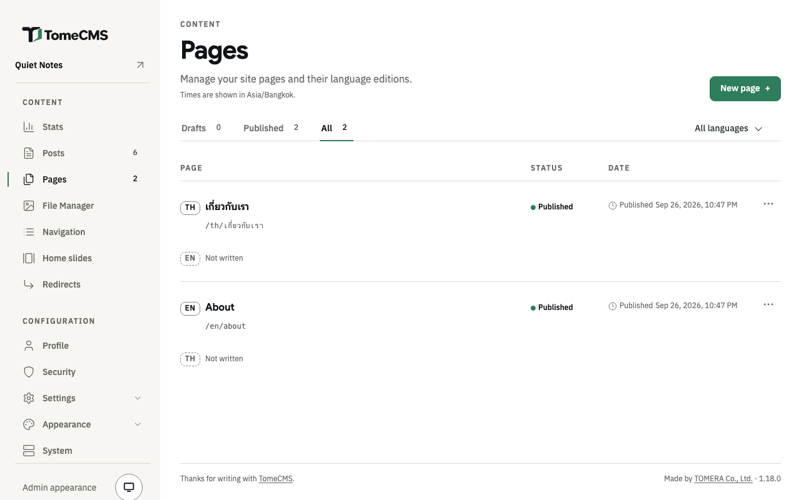

"Pages", under "Content", holds the pages that stand apart from the blog, such as an About page. A page is not listed on the home page the way a post is. Readers reach it through a link, usually one in a menu, and "Navigation" is where you arrange the menus.

## The list of pages

Each row is one page, with a line for every language edition you have written, its address, its status and its date in the site's time zone. The tabs "Drafts", "Published" and "All" work as they do for posts. "Search pages" finds a page by its title, and "Language" narrows the list once you press "Apply filters".

The "..." beside an edition has "Edit", "Preview", "Copy link", "Duplicate", "Publish" or "Unpublish", and "Delete". "Copy link" is there once the edition is published, and puts its address on the clipboard. Deleting an edition cannot be undone, and takes it out of every menu too. The exception is a parent with sub-items, which stays in the menu as a group ([Sub-menus and groups](#sub-menus-and-groups)). "Not written" starts the page in the other language.

## Writing a page

"New page" opens the editor in the site's default language. It is the post editor, with the same blocks, images, files and formatting, and [Writing](/tome-cms/admin/writing/) describes them. Its bar has "Back to Pages", and a page publishes the way a post does, as [Publishing](/tome-cms/admin/publishing/) describes.

A page has no categories and no cover image. "Settings" opens "Page settings":

| Field | What it does |
| --- | --- |
| "URL name" | The page's address, after `/en/` or `/th/`. |
| "Publish at" | When the page goes out, as for a post. |
| "Excerpt" | Under "Summary": a short line a theme can show where it lists or links to the page, up to 120 characters. Neither theme that comes with TomeCMS shows it yet. |
| "Search title" | The title in search results, up to 70 characters. Left blank, the page's own title is used. |
| "Search description" | Used in search results and when the page is shared, up to 320 characters. |

With the "Jev (TypeSafe AI)" plugin on, the drawer offers a line for the excerpt and a passage for the search description, as it does for a post.

## Menus

"Navigation", under "Content", keeps four menus: "Header menu" and "Footer", each in Thai and in English. A reader sees the menus of the language they are reading in, and the theme decides where on the page each one goes.

Choose "Header menu" or "Footer" first, then the language, "ไทย" or "English", to see that menu.

### Adding an item

"Add item" opens "Add navigation item", for the language whose tab is open.

1. Under "Target", choose "Home", "Page" or "Custom URL". On the "Header menu" tab there is also "Group (no link)", described under [Sub-menus and groups](#sub-menus-and-groups). "Home" links to the home page in that language. "Page" lists the pages written in that language, drafts included. A page that exists only in the other language is shown greyed out, and needs an edition in this language before it can be added. "Custom URL" takes an address on this site that starts with `/`, such as `/contact`, or a full `http` or `https` address.
2. Type the "Label" readers see, from 1 to 80 characters. For a page, it starts as the page's title.
3. For a custom URL, tick "Open in a new tab" if it should open in one. Links to the home page and to pages always open in the same tab.
4. Under "Placement", choose "Header menu", "Footer" or "Both". "Both" adds a separate item to each menu, in that language.
5. Press "Add to menu".

A menu holds up to 50 items, sub-items included, and each target once, whether it sits at the top or under another item. Adding the same one again gets "This target is already in one of the selected menus."

### Arranging and saving

Change an item's label in its field. "Move up" and "Move down" move it, and so does dragging it by the handle on its left. "Remove" takes it out.

Nothing reaches the site until you press "Save menu", and each menu is saved on its own. A tab with changes not saved yet is marked "Unsaved", and the line beside the button says "Unsaved changes in this menu". Once saved, the admin says "Menu saved." If the save fails, your edits stay on the screen, and "Retry save" tries again.

An item for a page stores the page itself, so it follows the page when its address changes. While the page is not published, the admin marks the item as hidden, and readers do not see it. Deleting the page removes its items, except a page that has sub-items under it, as [Sub-menus and groups](#sub-menus-and-groups) describes.

### Sub-menus and groups

An item in the "Header menu" can hold a sub-menu. The "Footer" stays flat. A sub-menu goes one level deep: a sub-item cannot hold items of its own.

On the "Header menu" tab, drag an item by the handle on its left. The line above the list says what letting go will do:

- Onto the middle of a top-level item, the item goes under it, as its last sub-item: "Put under About". The item you are over is outlined.
- Onto the top or bottom edge of a top-level item, the item goes above it, or below it and its sub-items, at the top level: "Above Blog, main menu". A line shows where.
- Onto a sub-item, the upper half places the item above that sub-item and the lower half below it, in the same sub-menu: "In About's sub-menu, below Team".

Some drops are refused, and the line says why. An item that already holds sub-items, or a group, cannot go under another item, and an item cannot be dropped onto itself or its own sub-items. Letting go there changes nothing, and Escape cancels a drag. On a phone, drag with a finger on the handle; the rest of the row still scrolls the page. On the "Footer", dragging only places an item above or below another.

Two of these choices are also in the ⋯ button beside "Move up" and "Move down", which a screen reader calls "Sub-menu options", for the keyboard and screen readers:

- "Put under", followed by the name of the top-level item above, makes the item the last sub-item of that item. When the item just above is a sub-item, the item joins its parent.
- "Move out to the main menu" is on a sub-item. It puts the item back at the top level, right after its parent's last sub-item.

The ⋯ button is there only when one of them applies, so not on the first item, a group, an item that already holds sub-items, or the "Footer".

A sub-item's row is drawn indented, with a line beside it, and a screen reader announces which item it is under. Moving a parent, with "Move up", "Move down" or by dragging, takes its sub-items with it. "Move up" and "Move down" keep a sub-item among the items under the same parent; dragging it, or "Move out to the main menu", takes it elsewhere. "Remove" on a parent takes out that item alone: its sub-items stay in the menu, at the top level.

A parent can be a link, such as a page or "Home", or a group. A group is a label with no link, and all it does is open its sub-menu. Add one with "Add item", "Group (no link)" and a "Label". A new item always goes to the end of the menu at the top level, so add the group first, then move items under it. A group needs at least one item under it. Until it has one, its row says "A group needs at least one item under it." and "Save menu" stays unavailable.

A sub-item for a page that is not published is marked "Hidden: draft", and readers do not see it. A parent whose own page is not published is marked "Hidden: draft" too, but readers still get it, as a group, with the same label, as long as one of its sub-items is shown. A group with no sub-item left to show is not shown at all. Deleting a page that is a parent with sub-items does not remove the item: it stays in the menu as a group, with its label and its place, and keeps its sub-items. An item with no sub-items goes with its page, as before.

#### On the site

The parent opens a small panel under it: on a wide screen in "Paper", and at every width in "Plain". For a link parent, that is a ▾ button beside the link, named "Show the {label} menu" for a screen reader, so the link still goes to the page. For a group, the label itself is the button. A click or tap opens the panel, never a hover. Another click on the button, a click anywhere else on the page, or Escape closes it, and Escape puts the focus back on the button. Only one panel is open at a time, and one that would run past the edge of the window opens against its parent's far edge instead. Opening and closing with the button works with scripts turned off too. A parent that holds the page being viewed looks like the current item.

On a phone, "Paper" lists the sub-items under their parent inside "Menu", indented and always shown, so there is no second tap. A link parent stays a link, and a group is a small label above its items. "Plain" has no "Menu": the header keeps its row, and the panel opens from the ▾ or the group's label and spans the width of the header, just under it.

A theme of your own draws sub-menus as [Writing a theme](/tome-cms/extending/themes/#drawing-sub-menus) describes.
