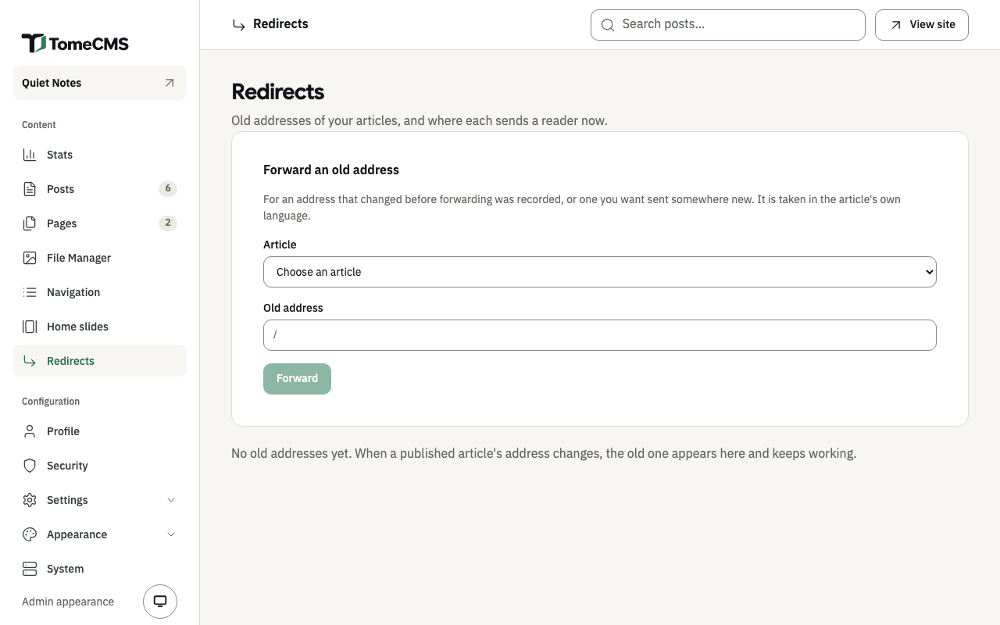

Publishing puts a post or a page on the public site, now or at a time you set. Each one has an address made from its title, and "Redirects", under "Content", keeps an old address working after it changes.

## Publishing now

In the editor, press "Publish". The article has to have something in it first. An empty one gets "Add content before publishing: this is still empty."

Once it is published, the button says "Update". A published post or page has no separate draft: the editor's saves go to the published article, so readers see an edit a moment after you make it. To work on it out of sight, take it off the site first, or duplicate it and work on the copy.

"Unpublish", in the "..." menu beside it in the list, turns it back into a draft and takes it off the site. "Publish" in the same menu puts a draft out without opening it.

## Publishing later

Open "Settings" in the editor, set "Publish at" to a date and time, and press "Publish". Until that time the article stays off the site. Its address answers `404`, and it is not on the home page, in the feed or the sitemap, in its category, in a menu, or in the content API. The list shows it under "Published", marked "Scheduled". When the time comes it appears on its own, with nothing to press.

"Publish at" is read in your device's time zone. The list shows dates in the site's time zone, which it names in brackets beside each date.

Set the date and press "Publish" in the same sitting. A draft keeps no date, so a date left in a draft is gone the next time you open it. Left blank, "Publish at" means now. A date that has already passed publishes the article at once, dated then.

On an article that is already published, a new "Publish at" takes effect with the next autosave, and a later date takes it off the site until then.

The same "Publish at" is in a page's settings, and works the same way.

## Addresses

A post lives at `/en/blog/` or `/th/blog/` followed by its slug, and a page at `/en/` or `/th/` followed by its slug. The slug comes from the title, in the title's own language. A Thai title gets a Thai address, with a hyphen between each pair of words, and browsers show it in Thai. Type a Latin one into "Slug" in the settings if you prefer.

When it is saved, a slug is tidied into lower-case letters, digits, Thai and single hyphens. A blank one is made from the title again. Two posts in the same language cannot share an address, and neither can two pages, so a save that would do that fails until you change one of them.

## When an address changes

Change the slug of an article that is published or scheduled, and its old address keeps working. It answers with a permanent redirect (`301`) to wherever the article is now, however many times it has moved since, so links others shared and search engines both follow it.

A redirect only takes a reader somewhere while the article is on the site. While it is a draft or waiting for its date, the old address answers `404` like the new one. When the article is deleted, its old addresses go with it.

## The Redirects screen

"Redirects", under "Content", lists every old address, the article it leads to and where that is now, and the date it was recorded. An article that is not on the site at the moment shows "Not published, so this answers 404 until it is." The bin button beside a row stops that address forwarding.

"Forward an old address" adds one by hand, for an address that changed before these were recorded, or one you want sent somewhere new:

1. Under "Article", choose the post or page. Each is listed with its language, such as `EN · About`.
2. Under "Old address", type the old slug after the path the field shows, such as `/en/blog/`. The address is taken in the article's own language.
3. Press "Forward".

The admin refuses an old address that a post of yours already has in that language (for a page, one of your pages), and one with anything other than lower-case letters, Thai, digits and single hyphens. An old address that already forwards somewhere is pointed at the article you chose instead.
