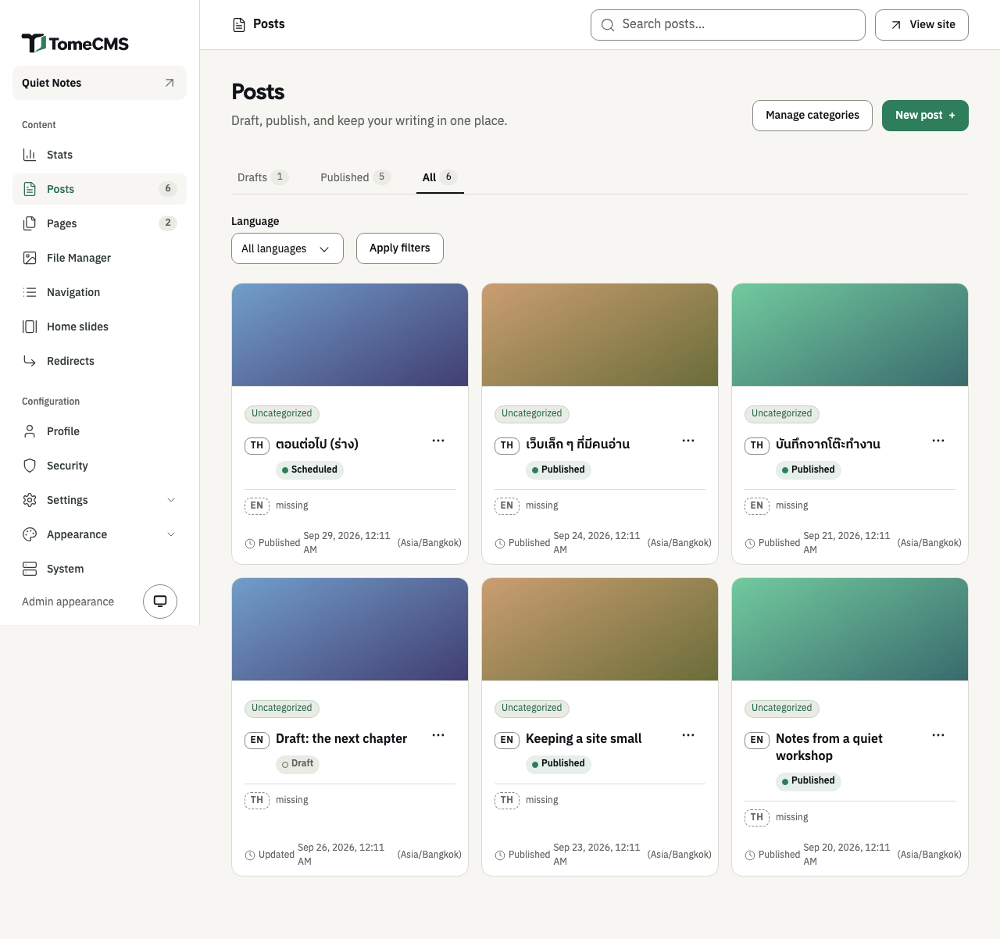
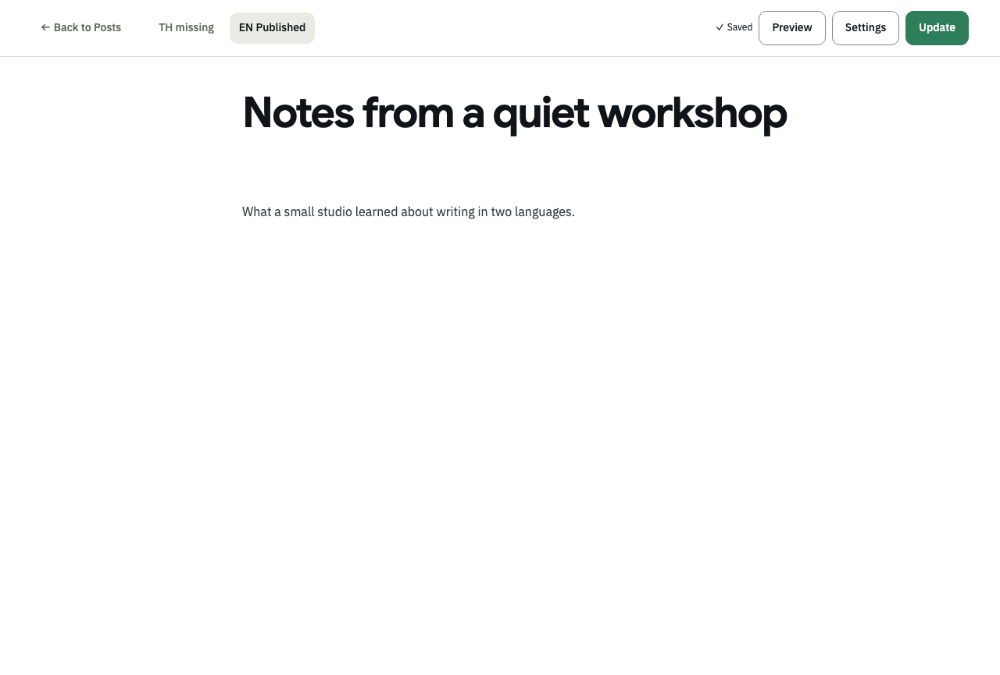

"Posts", under "Content" in the admin, lists every post you have written, and the editor is where you write one. A post can have a Thai edition and an English edition. Each is written on its own, and the list keeps them together on one card.

## Finding a post

The list opens on "Drafts". "Published" and "All" sit beside it, each with a count. "Language" narrows the list to "Thai" or "English" once you press "Apply filters", and "Search posts…" at the top of the admin finds a post by its title.

Each card is one post. It shows every edition you have written, with its status, and a "missing" line for a language you have not. Press a title to open that edition in the editor, or "missing" to start the other language. The "..." beside an edition has "Edit", "Preview", "Duplicate", "Publish" or "Unpublish", and "Delete".

"Duplicate" makes a new draft from that edition, in the same language, with "(copy)" after its title and the same categories. It is a separate post, not the other language of this one. "Delete" removes that language edition only, and cannot be undone.

## Starting a post

Press "New post". The editor opens in the site's default language. Type the title where "Untitled post" is in grey, and the article below it, where the editor says "Type '/' for commands". A title takes up to 200 characters.

The editor saves on its own a moment after you stop typing, once the post has a title. The bar says "Saving…" and then "Saved". If a save fails, it says "Save failed" and offers "Retry save", and what you wrote stays on the screen. "Back to Posts" saves before it leaves. When it cannot save, the admin asks first, with "Leave without saving?".

"Preview" saves the post and opens it in a new tab, drawn by the site's theme, even while it is a draft. It needs a title.

## Adding blocks

Type `/` at the start of a line, or after a space, and a menu opens: "Heading 2", "Heading 3", "Bullet list", "Code block", "Quote", "Table" and "File". Keep typing to narrow it, and press Enter to choose.

The "+" button beside the line you are on ("Add block") opens the longer list. It has "Text" and "Heading 1" as well, and "Image". Use the arrow keys and Enter, or click.

A new table has three rows and three columns, the first row a header. While the cursor is in it, a bar over its corner has "Add row", "Add column", "Delete row", "Delete column" and "Delete table", and the same actions come first in the `/` menu.

## Formatting words

Select some words and a bar appears over them: "Bold", "Italic", "Link" and "Inline code", then "Align left", "Align center" and "Align right". Alignment applies to whole lines, or to the table cells the cursor is in.

"Link" opens "Add a link". Paste an `http` or `https` address into "URL" and press "Apply link". "Open in a new tab" is on to begin with; switch it off for a link that should open in the same tab. To take a link off, select the linked words and press "Link" again.

## Pictures

Choose "Image" from the "+" menu. The "File Manager" opens as a picker: press a picture to put it where the cursor was, or "Upload image" to add a new one and put it there. A picture chosen this way carries the "Alt text" it has in the File Manager, or its file name when it has none.

You can also drop a picture file onto the article, or paste one. It shows faintly while it uploads to the File Manager, then takes its place. The File Manager takes JPEG, PNG, WebP, GIF and AVIF, up to 8 MB. Anything else gets "Image upload failed" and the reason.

A picture copied from another website together with its text can keep its address on that site, and every reader's browser then fetches it from there. [What a reader's browser keeps](/tome-cms/running/privacy/) explains what that site gets to see. Upload the picture instead.

## Files

Choose "File" from the "+" menu or from `/`. The picker shows files only: PDF, Word, Excel, PowerPoint, CSV, text and ZIP, up to 25 MB each. Press one, or "Upload file" to add a new one.

The file goes into the article as a card with its name, its type and its size. A reader who clicks it downloads the file, except a PDF, which opens in a new tab.

## The post's settings

"Settings" in the bar opens "Post settings". It saves along with the rest of the post.

| Field | What it does |
| --- | --- |
| "Slug" | The post's address, after `/en/blog/` or `/th/blog/`. It follows the title until you change it by hand. A Thai title gets a Thai address, with a hyphen between words. |
| "Publish at" | When the post goes out. [Publishing](/tome-cms/admin/publishing/) explains it. |
| "Categories" | Tick the ones the post belongs under. With none ticked, it goes under the default one. Both language editions share the same categories. "Manage categories" saves the post and opens the list of categories. |
| "Cover image" | The picture on the post's card and at the top of the post. "Choose image" opens the File Manager. 1600 × 900 pixels and under 2 MB is best, and 8 MB is the most it takes. |
| "Excerpt" | Under "Homepage card": the line on the post's card, up to 120 characters. Left blank, the card uses the meta description, then the opening of the post. |
| "Meta title" | The title in search results, up to 70 characters. Left blank, the post's own title is used. |
| "Meta description" | Shown below the article's title, and used in search results and when the post is shared. Up to 320 characters. |

## Writing the other language

The chips in the bar show each language and how it stands, such as "EN Published" and "TH missing". Press the other language's chip and the admin saves this edition, then opens that one. A new edition starts empty, with this one's cover picture and categories. It has its own title, address and settings, and you publish it on its own.

"missing" on the post's card in the list does the same.

## Suggestions while writing

With the "Jev (TypeSafe AI)" plugin switched on, under "Appearance" and then "Plugins", the settings drawer has three more buttons. "Suggest from the text" offers categories you already have. "Suggest a line from the text" offers a sentence from the article for the excerpt, and "Suggest a description from the text" one for the meta description.

Nothing is filled in for you. A suggested category is a chip you press to add it, and a sentence has its own "Use this line" or "Use as the description" button. The article's text goes to TypeSafe AI when you press one of the three buttons, and at no other time. Without the plugin, the buttons are not there.

The page editor works the same way. [Pages and menus](/tome-cms/admin/pages-and-menus/) covers what is different about pages.
