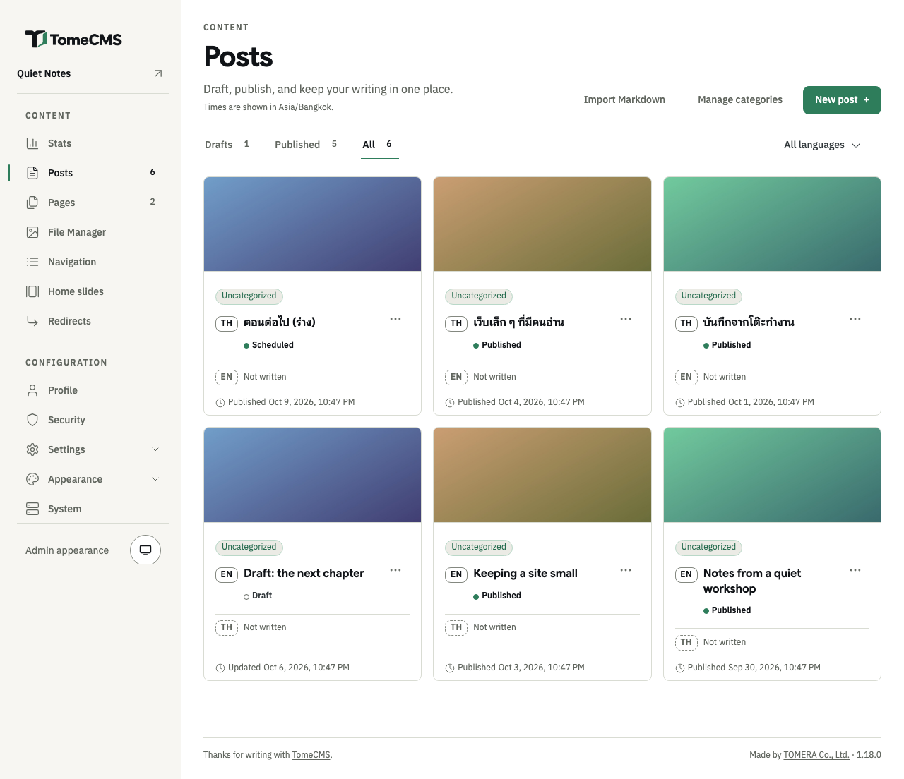
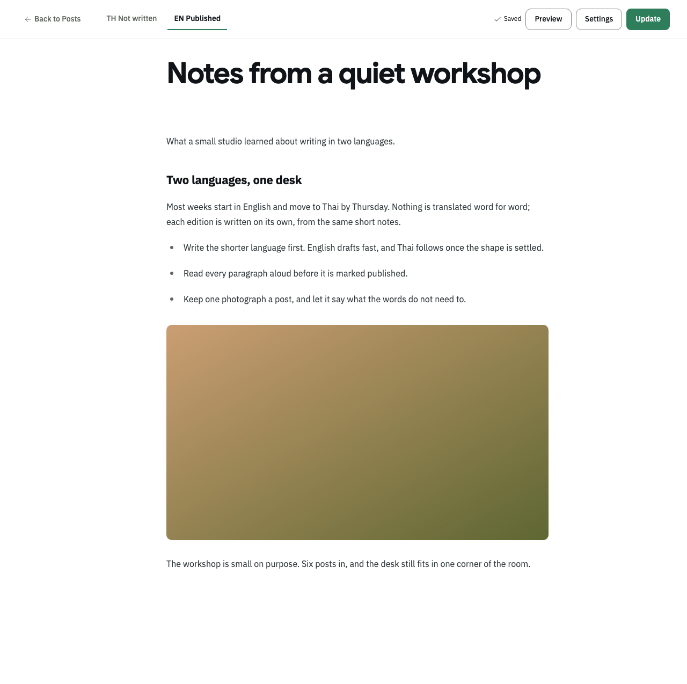

"Posts", under "Content" in the admin, lists every post you have written, and the editor is where you write one. A post can have a Thai edition and an English edition. Each is written on its own, and the list keeps them together on one card.



## Finding a post

The list opens on "Drafts". "Published" and "All" sit beside it, each with a count. "Language" narrows the list to "Thai" or "English" once you press "Apply filters", and "Search posts…" at the top of the admin finds a post by its title.

Each card is one post. It shows every edition you have written, with its status, and a "Not written" line for a language you have not. Press a title to open that edition in the editor, or "Not written" to start the other language. The "..." beside an edition has "Edit", "Preview", "Copy link", "Duplicate", "Publish" or "Unpublish", and "Delete". "Copy link" is there once the edition is published, and puts its address on the clipboard; if the browser will not copy, the address is shown to copy by hand.

"Duplicate" makes a new draft from that edition, in the same language, with "(copy)" after its title ("(สำเนา)" for a Thai edition) and the same categories. It is a post of its own, and does not become this post's other language. "Delete" removes that language edition only, and cannot be undone.

## Starting a post

Press "New post". The editor opens in the site's default language. Type the title where "Untitled post" is in grey, and the post below it, where the editor says "Type '/' for commands". A title takes up to 200 characters.



The editor saves on its own a moment after you stop typing, once the post has a title. The bar says "Saving…" and then "Saved". If a save fails, it says "Save failed" and offers "Retry save", and what you wrote stays on the screen. "Back to Posts" saves before it leaves. When it cannot save, the admin asks first, with "Leave without saving?".

"Preview" saves the post and opens it in a new tab, drawn by the site's theme, even while it is a draft. It needs a title.

## Importing from Markdown

"Import Markdown", beside "New post", turns one `.md` file into one draft. Nothing is published. The file can be up to 900 KB.

The settings at the top of the file, between two `---` lines, fill the post: `title`, `slug`, `locale` (`th` or `en`), `date`, `categories`, `excerpt` or `description`, `meta_title`, `meta_description`, and `cover` or `image`. Each is optional. Without a `title`, the first level 1 heading is the title, then the file name. Without a `locale`, the post is in the site's default language. A category is matched to one of yours by its name; one you do not have is named in the report and not created. If another post in the same language already has the URL name, the new post gets a few letters and digits after it, and the report says so. Whatever the file says about `status`, the post is a draft.

The server does not download pictures. After you choose the file, the sheet says what the post will get, its language, URL name and categories, then lists every picture in it:

- A picture from another site's address stays loaded from that site.
- A picture from your computer needs its file. Choose the picture files, several at once if you like, and each is matched to the post by its file name, whatever its capital letters. You can also choose a file for one picture, or skip it. The import starts once every picture has a file or is skipped.
- A skipped picture becomes a line such as `[Missing image: photo.png]` where it was, or `[รูปที่ขาด: photo.png]` in a Thai post. Search the draft for it to put the picture in later.

The chosen pictures go into the File Manager, in "Unsorted" with no folder, and stay there if you close the sheet partway. When the import is done the sheet lists what it changed on the way, then "Open the draft" opens it in the editor.

Fenced code keeps its language, so a block written as ` ```ts ` opens as "TypeScript". Some things in a Markdown file have no place in a post and are left out, with a note in the report: HTML, the links of footnotes and links to other files or to email addresses (their words stay), and the checkboxes of a task list. Headings deeper than level 3 become level 3.

A file that is very long or very complex is refused, and the sheet says which part is too much and what to do: split the file, or simplify it. So is a second file sent while another is being read; try again in a moment.

## Adding blocks

Type `/` at the start of a line, or after a space, and a menu opens: "Heading 2", "Heading 3", "Bullet list", "Numbered list", "Code block", "Quote", "Table", "File" and "Video". Keep typing to narrow it, and press Enter to choose.

The "+" button beside the line you are on ("Add block") opens the longer list. It has "Text" and "Heading 1" as well, and "Image" and "New part". "New part" is a break between sections, drawn as three centred dots with room above and below. Use the arrow keys and Enter, or click.

A new table has three rows and three columns, the first row a header. While the cursor is in it, a bar over its corner has "Add row", "Add column", "Delete row", "Delete column" and "Delete table", and the same actions come first in the `/` menu.

## Formatting words

Select some words and a bar appears over them: "Bold", "Italic", "Underline", "Strikethrough", "Link", "Inline code" and "Text colour", then "Align left", "Align center" and "Align right". Alignment applies to whole lines, or to the table cells the cursor is in. Ctrl+U (⌘U on a Mac) underlines and Ctrl+Shift+S (⌘⇧S) strikes through as well.

"Text colour" opens a row of swatches under the bar: "Default", "Red", "Orange", "Green", "Blue", "Purple" and "Grey". A colour is saved by its name, and the theme gives each one a shade for light mode and another for dark mode, so coloured words stay readable when a reader's screen is dark. "Default" takes the colour off.

"Link" opens "Add a link". Paste an `http` or `https` URL into "URL" and press "Apply link". "Open in a new tab" is on to begin with; switch it off for a link that should open in the same tab. To link to a file instead, press "Choose from the File Manager" and pick a document or a picture; the link is the file's address on your site, and the File Manager will not delete the file while a post or page links to it. To take a link off, select the linked words and press "Link" again.

## Code

Choose "Code block" from the "+" menu or from `/`. The block has a picker in its top-left corner, "Language", and a new block starts at "None": the code is shown as typed, in a light box, with no colour. Open the picker to choose one of "Bash", "C", "C#", "C++", "CSS", "Dart", "Diff", "Go", "GraphQL", "HTML, XML", "Java", "JavaScript", "JSON", "Kotlin", "Markdown", "PHP", "Python", "Ruby", "Rust", "SQL", "Swift", "TOML, INI", "TypeScript" and "YAML". The code is coloured as you type.

"Auto" lets the editor guess. Once you stop typing for a moment, the picker reads "Auto (TypeScript)", or whichever language it found. The guess is poorest on a line or two, and when it has nothing to go on the picker says only "Auto" and the code stays plain. If it guesses wrong, choose the language yourself.

Press Tab to reach the picker like any other button, and Escape to close its list and go back to the code. Press the Down arrow at the end of a block that ends the post to start a new line below it.

On the site, the code is coloured before the page is sent, so it needs nothing from the reader's browser. The language's name is written small in the block's top-left corner, except for "None" and for an "Auto" that found nothing. The block is light on a light page and dark on a dark one. A block of more than 20,000 characters is shown without colour, "Auto" reads only the first 2,000 characters of a block to find its language, and one post colours 50,000 characters of code in all: blocks after that are shown plain and keep the language you chose. Posts written before a block had a language are "None", and stay as they were.

## Images

Choose "Image" from the "+" menu. The "File Manager" opens as a picker: press an image to put it where the cursor was, or "Upload image" to add a new one and put it there. An image chosen this way carries the "Alt text" it has in the File Manager, or its file name when it has none.

You can also drop an image file onto the post, or paste one. It shows faintly while it uploads to the File Manager, then takes its place. The File Manager takes JPEG, PNG, WebP, GIF and AVIF, up to 8 MB. Anything else gets "Image upload failed" and the reason.

An image copied from another website together with its text can keep its address on that site, and every reader's browser then fetches it from there. [What a reader's browser keeps](/tome-cms/running/privacy/) explains what that site gets to see. Upload the image instead.

## Files

Choose "File" from the "+" menu or from `/`. The picker shows files only: PDF, Word, Excel, PowerPoint, CSV, text and ZIP, up to 25 MB each. Press one, or "Upload file" to add a new one.

The file goes into the post as a card with its name, its type and its size. A reader who clicks it downloads the file, except a PDF, which opens in a new tab.

## Videos

Paste a YouTube or Vimeo link alone on an empty line and it becomes a video. Pasted into a sentence, or on an empty line inside a table, a list or a quote, it stays a link. You can also choose "Video" from the "+" menu or from `/`, outside a table. It opens "Add a video": paste the link into "Link" and press Enter. A link that is not to one YouTube or Vimeo clip gets "Use a YouTube or Vimeo link to one clip."

The video goes into the post at once as a card with the clip's id and "YouTube" or "Vimeo". A moment later the card shows the clip's title and its poster, which the server fetched from YouTube or Vimeo and keeps in the File Manager. The card moves and deletes like any other block.

When YouTube or Vimeo gives no title and poster, the editor tells you why under "The video is in, without its poster": the clip may be private, or the server could not reach YouTube or Vimeo in time. The clip stays in the post, without a poster, and you can still publish it. Readers who can see the clip can play it.

On the site, a reader sees the poster with a play mark, and nothing loads from YouTube or Vimeo until they press play. [What a reader's browser keeps](/tome-cms/running/privacy/) explains what happens then.

## The post's settings

"Settings" in the bar opens "Post settings". It saves along with the rest of the post.

| Field | What it does |
| --- | --- |
| "URL name" | The post's address, after `/en/blog/` or `/th/blog/`. While a new post is open for the first time, it follows the title until you change it by hand. Once the post is opened again, changing the title leaves the slug as it is. A Thai title gets a Thai address, with a hyphen between words. |
| "Publish at" | When the post goes out. [Publishing](/tome-cms/admin/publishing/) explains it. |
| "Categories" | Tick the ones the post belongs under. With none ticked, it goes under the default one. Both language editions share the same categories. "Manage categories" saves the post and opens the list of categories. |
| "Cover image" | The image on the post's card and at the top of the post. "Choose image" opens the File Manager. 1600 × 900 pixels and under 2 MB is best, and 8 MB is the most it takes. |
| "Excerpt" | Under "Homepage card": the line on the post's card, up to 120 characters. Left blank, the card uses the search description, then the opening of the post. |
| "Search title" | The title in search results, up to 70 characters. Left blank, the post's own title is used. |
| "Search description" | Shown below the post's title in the Paper theme, and used in search results and when the post is shared. Up to 320 characters. |

## Writing the other language

The chips in the bar show each language and how it stands, such as "EN Published" and "TH Not written". Press the other language's chip and the admin saves this edition, then opens that one. A new edition starts empty, with this one's cover image and categories. It has its own title, address and settings, and you publish it on its own.

"Not written" on the post's card in the list does the same.

## Suggestions while writing

With the "Jev (TypeSafe AI)" plugin switched on, under "Appearance" and then "Plugins", the settings drawer has three more buttons. "Suggest from the text" offers categories you already have. "Suggest a line from the text" offers a sentence from the post for the excerpt, and "Suggest a description from the text" one for the search description.

Nothing is filled in for you. A suggested category is a chip you press to add it, and a sentence has its own "Use this line" or "Use as the description" button. "Another one" beside it offers a different sentence, never one you have already been shown; when the post has no other, it says so, and the next press starts again. The post's text goes to TypeSafe AI when you press one of the three buttons, and at no other time. Without the plugin, the buttons are not there.

The page editor works the same way. [Pages and menus](/tome-cms/admin/pages-and-menus/) covers what is different about pages.
