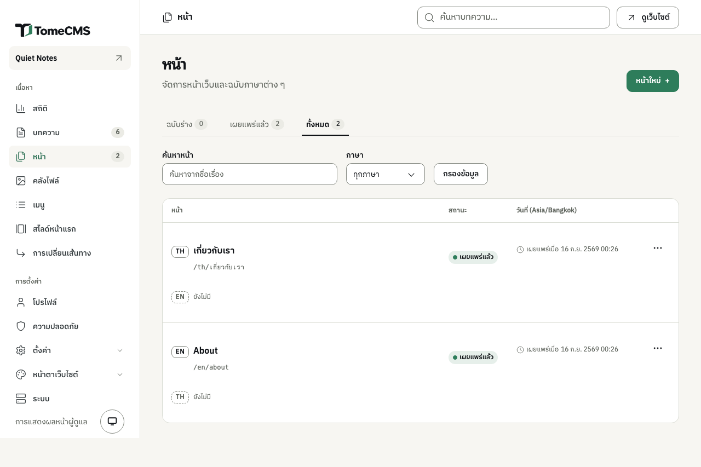
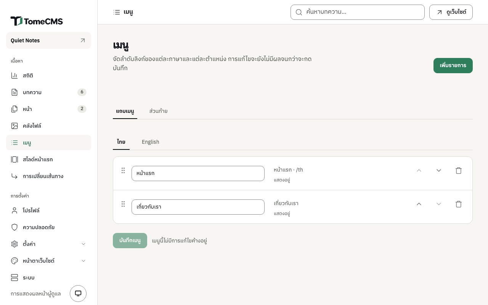

เมนู "หน้า" ใต้ "เนื้อหา" เก็บหน้าที่แยกออกมาจากบล็อก เช่น หน้าเกี่ยวกับเรา หน้าเหล่านี้ไม่ขึ้นในหน้าแรกเหมือนบทความ ผู้อ่านจะมาถึงได้ผ่านลิงก์ ซึ่งส่วนใหญ่อยู่ในเมนู และหน้า "เมนู" ในหน้าแอดมินคือที่ที่ใช้จัดลิงก์เหล่านั้น

## รายการหน้า

แต่ละแถวคือหนึ่งหน้า มีบรรทัดของทุกฉบับภาษาที่เขียนไว้ พร้อมที่อยู่ สถานะ และวันที่ตามเขตเวลาของเว็บ แท็บ "ฉบับร่าง" "เผยแพร่แล้ว" และ "ทั้งหมด" ใช้แบบเดียวกับของบทความ ช่อง "ค้นหาหน้า" ใช้หาหน้าจากชื่อเรื่อง และช่อง "ภาษา" ใช้กรองรายการเมื่อกด "กรองข้อมูล"

ปุ่ม "..." ข้างแต่ละฉบับมี "แก้ไข" "ดูตัวอย่าง" "ทำสำเนา" "เผยแพร่" หรือ "ยกเลิกเผยแพร่" และ "ลบ" การลบฉบับใดจะเอาฉบับนั้นออกจากทุกเมนูด้วย และย้อนกลับไม่ได้ ส่วน "ยังไม่มี" ใช้เริ่มเขียนหน้านั้นในอีกภาษา

## เขียนหน้า

"หน้าใหม่" เปิดหน้าแก้ไขในภาษาเริ่มต้นของเว็บ หน้าแก้ไขนี้คือตัวเดียวกับที่ใช้เขียนบทความ มีบล็อก ภาพ ไฟล์ และการจัดรูปแบบเหมือนกัน ซึ่งอธิบายไว้ในหน้า[การเขียนบทความ](/tome-cms/th/admin/writing/) แถบด้านบนมีปุ่ม "กลับไปหน้าเพจ" และการเผยแพร่หน้าก็ทำแบบเดียวกับบทความ ตามที่หน้า[การเผยแพร่](/tome-cms/th/admin/publishing/) อธิบายไว้

หน้าไม่มีหมวดหมู่และไม่มีภาพหน้าปก ปุ่ม "ตั้งค่า" จะเปิดแผง "ตั้งค่าเพจ"

| ช่อง | ใช้ทำอะไร |
| --- | --- |
| "ชื่อใน URL" | ที่อยู่ของหน้า ต่อจาก `/th/` หรือ `/en/` |
| "เผยแพร่เมื่อ" | เวลาที่หน้าจะขึ้นเว็บ ใช้แบบเดียวกับบทความ |
| "ข้อความย่อ" | ประโยคสั้น ๆ ที่ธีมใช้แสดงในรายการหน้า หรือข้างลิงก์ที่พามาหน้านี้ได้ ยาวไม่เกิน 120 ตัวอักษร ตอนนี้ยังไม่มีธีมที่มากับ TomeCMS ธีมไหนแสดงค่านี้ |
| "ชื่อสำหรับผลค้นหา" | ชื่อที่ขึ้นในผลการค้นหา ยาวไม่เกิน 70 ตัวอักษร ถ้าเว้นว่างจะใช้ชื่อเรื่องของหน้า |
| "คำอธิบายสำหรับผลค้นหา" | ใช้ในผลการค้นหาและตอนแชร์หน้านี้ ยาวไม่เกิน 320 ตัวอักษร |

ถ้าเปิดปลั๊กอิน "Jev (TypeSafe AI)" ไว้ แผงนี้จะเสนอประโยคมาให้ใช้เป็นข้อความย่อ และเป็นคำอธิบายสำหรับผลค้นหาได้ เหมือนกับของบทความ

## เมนู

หน้า "เมนู" ใต้ "เนื้อหา" เก็บเมนูไว้สี่ชุด คือ "แถบเมนู" และ "ส่วนท้าย" แต่ละชุดมีทั้งภาษาไทยและภาษาอังกฤษ ผู้อ่านจะเห็นเมนูของภาษาที่กำลังอ่านอยู่ ส่วนเมนูแต่ละชุดจะอยู่ตรงไหนของหน้านั้นธีมเป็นตัวกำหนด

เลือก "แถบเมนู" หรือ "ส่วนท้าย" ก่อน แล้วจึงเลือกภาษา "ไทย" หรือ "English" เพื่อดูเมนูชุดนั้น

### เพิ่มรายการ

"เพิ่มรายการ" เปิดหน้าต่าง "เพิ่มรายการในเมนู" สำหรับภาษาที่เปิดแท็บอยู่

1. ในช่อง "ปลายทาง" เลือก "หน้าแรก" "หน้า" หรือ "URL ที่กำหนดเอง" "หน้าแรก" ลิงก์ไปหน้าแรกของภาษานั้น "หน้า" แสดงหน้าที่เขียนไว้ในภาษานั้น รวมทั้งหน้าที่ยังเป็นฉบับร่าง หน้าที่มีแต่ในอีกภาษาจะขึ้นเป็นสีจางและเลือกไม่ได้ จนกว่าจะเขียนฉบับภาษานี้ก่อน ส่วน "URL ที่กำหนดเอง" รับที่อยู่ในเว็บนี้ที่ขึ้นต้นด้วย `/` เช่น `/contact` หรือที่อยู่เต็มที่ขึ้นต้นด้วย `http` หรือ `https`
2. พิมพ์ "ชื่อที่แสดง" ที่ผู้อ่านจะเห็น ยาว 1 ถึง 80 ตัวอักษร ถ้าเลือกหน้า ช่องนี้จะเริ่มจากชื่อเรื่องของหน้านั้น
3. ถ้าเป็น URL ที่กำหนดเอง ติ๊ก "เปิดในแท็บใหม่" ถ้าอยากให้เปิดในแท็บใหม่ ลิงก์ไปหน้าแรกและไปหน้าต่าง ๆ ในเว็บจะเปิดในแท็บเดิมเสมอ
4. ในช่อง "ตำแหน่งที่จะเพิ่ม" เลือก "แถบเมนู" "ส่วนท้าย" หรือ "ทั้งสองเมนู" ถ้าเลือก "ทั้งสองเมนู" จะได้รายการแยกกันในแต่ละเมนูของภาษานั้น
5. กด "เพิ่มเข้าเมนู"

เมนูหนึ่งชุดมีได้สูงสุด 50 รายการ และปลายทางเดียวกันใส่ได้ครั้งเดียว ถ้าเพิ่มซ้ำจะขึ้นว่า "ปลายทางนี้มีอยู่ในเมนูที่เลือกไว้แล้ว"

### จัดลำดับและบันทึก

แก้ชื่อรายการได้ในช่องของรายการนั้น ปุ่ม "เลื่อนขึ้น" และ "เลื่อนลง" ใช้ย้ายตำแหน่ง หรือจะลากที่จับทางซ้ายของรายการก็ได้ ส่วน "ลบออก" ใช้เอารายการออก

การแก้ไขจะยังไม่ขึ้นเว็บจนกว่าจะกด "บันทึกเมนู" และแต่ละเมนูบันทึกแยกกัน แท็บที่มีการแก้ไขที่ยังไม่บันทึกจะมีป้าย "ยังไม่บันทึก" และข้อความข้างปุ่มจะขึ้นว่า "เมนูนี้มีการแก้ไขค้างอยู่" เมื่อบันทึกแล้วจะขึ้นว่า "บันทึกเมนูแล้ว" ถ้าบันทึกไม่สำเร็จ สิ่งที่แก้ไว้ยังอยู่บนจอ และกด "ลองบันทึกอีกครั้ง" เพื่อลองใหม่ได้

รายการที่ชี้ไปหน้าหนึ่งเก็บตัวหน้านั้นไว้ ลิงก์จึงตามหน้าไปเองเมื่อที่อยู่เปลี่ยน ระหว่างที่หน้ายังไม่เผยแพร่ หน้าแอดมินจะบอกว่ารายการนั้นซ่อนอยู่ และผู้อ่านจะไม่เห็นรายการนี้ ถ้าลบหน้านั้น รายการที่ชี้ไปก็จะหายไปด้วย
