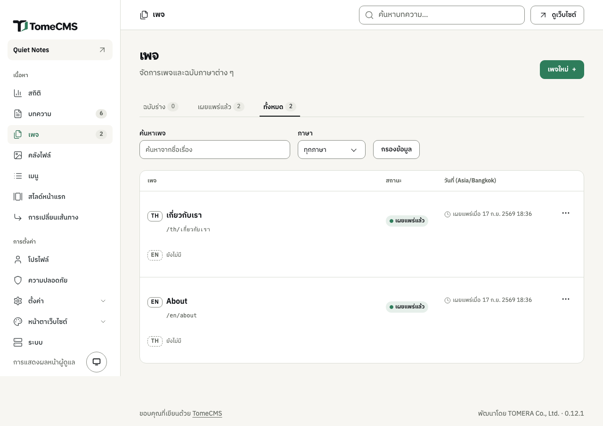
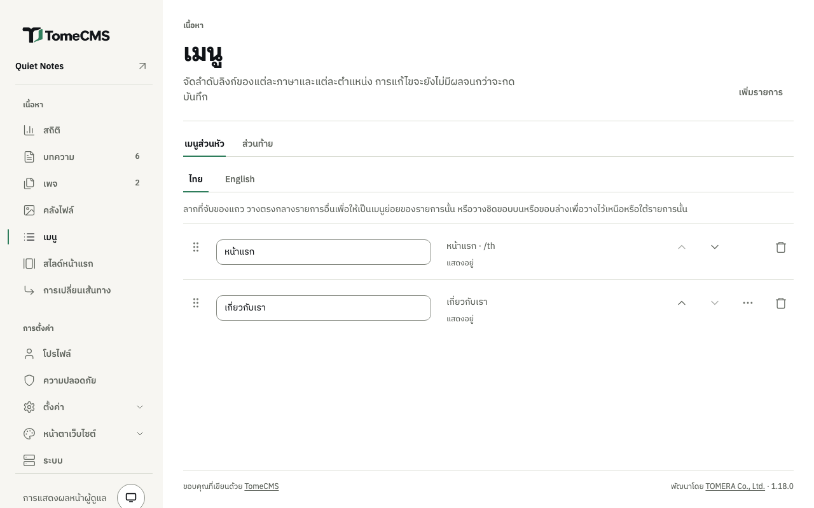

เมนู "เพจ" ใต้ "เนื้อหา" เก็บเพจที่แยกออกมาจากบล็อก เช่น เพจเกี่ยวกับเรา เพจเหล่านี้ไม่ขึ้นในหน้าแรกเหมือนบทความ ผู้อ่านจะมาถึงได้ผ่านลิงก์ ซึ่งส่วนใหญ่อยู่ในเมนู และหน้า "เมนู" ในหน้าแอดมินคือที่ที่ใช้จัดลิงก์เหล่านั้น

## รายการเพจ

แต่ละแถวคือหนึ่งเพจ มีบรรทัดของทุกฉบับภาษาที่เขียนไว้ พร้อมที่อยู่ สถานะ และวันที่ตามเขตเวลาของเว็บ แท็บ "ฉบับร่าง" "เผยแพร่แล้ว" และ "ทั้งหมด" ใช้แบบเดียวกับของบทความ ช่อง "ค้นหาเพจ" ใช้หาเพจจากชื่อเรื่อง และช่อง "ภาษา" ใช้กรองรายการเมื่อกด "กรองข้อมูล"

ปุ่ม "..." ข้างแต่ละฉบับมี "แก้ไข" "ดูตัวอย่าง" "คัดลอกลิงก์" "ทำสำเนา" "เผยแพร่" หรือ "ยกเลิกเผยแพร่" และ "ลบ" "คัดลอกลิงก์" จะมีเมื่อฉบับนั้นเผยแพร่แล้ว และจะคัดลอกที่อยู่ของฉบับนั้นไปไว้ในคลิปบอร์ด การลบฉบับใดย้อนกลับไม่ได้ และจะเอาฉบับนั้นออกจากทุกเมนูด้วย ยกเว้นรายการหลักที่มีรายการย่อยอยู่ ซึ่งจะยังอยู่ในเมนูเป็นกลุ่ม ตามที่[เมนูย่อยและกลุ่ม](#เมนูย่อยและกลุ่ม)อธิบายไว้ ส่วน "ยังไม่มี" ใช้เริ่มเขียนเพจนั้นในอีกภาษา

## เขียนเพจ

"เพจใหม่" เปิดหน้าแก้ไขในภาษาเริ่มต้นของเว็บ หน้าแก้ไขนี้คือตัวเดียวกับที่ใช้เขียนบทความ มีบล็อก ภาพ ไฟล์ และการจัดรูปแบบเหมือนกัน ซึ่งอธิบายไว้ในหน้า[การเขียนบทความ](/tome-cms/th/admin/writing/) แถบด้านบนมีปุ่ม "กลับไปรายการเพจ" และการเผยแพร่เพจก็ทำแบบเดียวกับบทความ ตามที่หน้า[การเผยแพร่](/tome-cms/th/admin/publishing/) อธิบายไว้

เพจไม่มีหมวดหมู่และไม่มีภาพหน้าปก ปุ่ม "ตั้งค่า" จะเปิดแผง "ตั้งค่าเพจ"

| ช่อง | ใช้ทำอะไร |
| --- | --- |
| "ชื่อใน URL" | ที่อยู่ของเพจ ต่อจาก `/th/` หรือ `/en/` |
| "เผยแพร่เมื่อ" | เวลาที่เพจจะขึ้นเว็บ ใช้แบบเดียวกับบทความ |
| "ข้อความย่อ" | ประโยคสั้น ๆ ที่ธีมใช้แสดงในรายการเพจ หรือข้างลิงก์ที่พามายังเพจนี้ได้ ยาวไม่เกิน 120 ตัวอักษร ตอนนี้ยังไม่มีธีมที่มากับ TomeCMS ธีมไหนแสดงค่านี้ |
| "ชื่อสำหรับผลค้นหา" | ชื่อที่ขึ้นในผลการค้นหา ยาวไม่เกิน 70 ตัวอักษร ถ้าเว้นว่างจะใช้ชื่อเรื่องของเพจ |
| "คำอธิบายสำหรับผลค้นหา" | ใช้ในผลการค้นหาและตอนแชร์เพจนี้ ยาวไม่เกิน 320 ตัวอักษร |

ถ้าเปิดปลั๊กอิน "Jev (TypeSafe AI)" ไว้ แผงนี้จะแนะนำประโยคมาให้ใช้เป็นข้อความย่อ และเป็นคำอธิบายสำหรับผลค้นหาได้ เหมือนกับของบทความ

## เมนู

หน้า "เมนู" ใต้ "เนื้อหา" เก็บเมนูไว้สี่ชุด คือ "เมนูส่วนหัว" และ "ส่วนท้าย" แต่ละชุดมีทั้งภาษาไทยและภาษาอังกฤษ ผู้อ่านจะเห็นเมนูของภาษาที่กำลังอ่านอยู่ ส่วนเมนูแต่ละชุดจะอยู่ตรงไหนของหน้านั้นธีมเป็นตัวกำหนด

เลือก "เมนูส่วนหัว" หรือ "ส่วนท้าย" ก่อน แล้วจึงเลือกภาษา "ไทย" หรือ "English" เพื่อดูเมนูชุดนั้น

### เพิ่มรายการ

"เพิ่มรายการ" เปิดหน้าต่าง "เพิ่มรายการในเมนู" สำหรับภาษาที่เปิดแท็บอยู่

1. ในช่อง "ปลายทาง" เลือก "หน้าแรก" "เพจ" หรือ "URL ที่กำหนดเอง" ในแท็บ "เมนูส่วนหัว" จะมี "กลุ่ม (ไม่มีลิงก์)" เพิ่มมาอีกตัวเลือก ซึ่งอธิบายไว้ใน[เมนูย่อยและกลุ่ม](#เมนูย่อยและกลุ่ม) "หน้าแรก" ลิงก์ไปหน้าแรกของภาษานั้น "เพจ" แสดงเพจที่เขียนไว้ในภาษานั้น รวมทั้งเพจที่ยังเป็นฉบับร่าง เพจที่มีแต่ในอีกภาษาจะขึ้นเป็นสีจางและเลือกไม่ได้ จนกว่าจะเขียนฉบับภาษานี้ก่อน ส่วน "URL ที่กำหนดเอง" รับที่อยู่ในเว็บนี้ที่ขึ้นต้นด้วย `/` เช่น `/contact` หรือที่อยู่เต็มที่ขึ้นต้นด้วย `http` หรือ `https`
2. พิมพ์ "ชื่อที่แสดง" ที่ผู้อ่านจะเห็น ยาว 1 ถึง 80 ตัวอักษร ถ้าเลือกเพจ ช่องนี้จะเริ่มจากชื่อเรื่องของเพจนั้น
3. ถ้าเป็น URL ที่กำหนดเอง ติ๊ก "เปิดในแท็บใหม่" ถ้าอยากให้เปิดในแท็บใหม่ ลิงก์ไปหน้าแรกและไปเพจต่าง ๆ ในเว็บจะเปิดในแท็บเดิมเสมอ
4. ในช่อง "ตำแหน่งที่จะเพิ่ม" เลือก "เมนูส่วนหัว" "ส่วนท้าย" หรือ "ทั้งสองเมนู" ถ้าเลือก "ทั้งสองเมนู" จะได้รายการแยกกันในแต่ละเมนูของภาษานั้น
5. กด "เพิ่มเข้าเมนู"

เมนูหนึ่งชุดมีได้สูงสุด 50 รายการ นับรวมรายการย่อย และปลายทางเดียวกันใส่ได้ครั้งเดียว ไม่ว่าจะอยู่ระดับบนหรืออยู่ใต้รายการอื่น ถ้าเพิ่มซ้ำจะขึ้นว่า "ปลายทางนี้มีอยู่ในเมนูที่เลือกไว้แล้ว"

### จัดลำดับและบันทึก

แก้ชื่อรายการได้ในช่องของรายการนั้น ปุ่ม "เลื่อนขึ้น" และ "เลื่อนลง" ใช้ย้ายตำแหน่ง หรือจะลากที่จับทางซ้ายของรายการก็ได้ ส่วน "เอาออก" ใช้เอารายการออก

การแก้ไขจะยังไม่ขึ้นเว็บจนกว่าจะกด "บันทึกเมนู" และแต่ละเมนูบันทึกแยกกัน แท็บที่มีการแก้ไขที่ยังไม่บันทึกจะมีป้าย "ยังไม่บันทึก" และข้อความข้างปุ่มจะขึ้นว่า "เมนูนี้มีการแก้ไขค้างอยู่" เมื่อบันทึกแล้วจะขึ้นว่า "บันทึกเมนูแล้ว" ถ้าบันทึกไม่สำเร็จ สิ่งที่แก้ไว้ยังอยู่บนจอ และกด "ลองบันทึกอีกครั้ง" เพื่อลองใหม่ได้

รายการที่ชี้ไปเพจหนึ่งเก็บตัวเพจนั้นไว้ ลิงก์จึงตามเพจไปเองเมื่อที่อยู่เปลี่ยน ระหว่างที่เพจยังไม่เผยแพร่ หน้าแอดมินจะบอกว่ารายการนั้นซ่อนอยู่ และผู้อ่านจะไม่เห็นรายการนี้ ถ้าลบเพจนั้น รายการที่ชี้ไปก็จะหายไปด้วย ยกเว้นเพจที่มีรายการย่อยอยู่ข้างใต้ ตามที่[เมนูย่อยและกลุ่ม](#เมนูย่อยและกลุ่ม)อธิบายไว้

### เมนูย่อยและกลุ่ม

รายการในแท็บ "เมนูส่วนหัว" มีเมนูย่อยได้ ส่วน "ส่วนท้าย" เป็นเมนูแบบเรียบเสมอ ส่วนเมนูย่อยมีได้ชั้นเดียว รายการย่อยมีรายการของตัวเองซ้อนต่อไม่ได้

ในแท็บ "เมนูส่วนหัว" ให้ลากที่จับทางซ้ายของรายการ บรรทัดเหนือรายการจะบอกว่าปล่อยแล้วจะเกิดอะไรขึ้น

- ปล่อยตรงกลางรายการระดับบน รายการที่ลากจะเข้าไปเป็นรายการย่อยตัวสุดท้ายของรายการนั้น เช่น "วางเป็นเมนูย่อยของ About" และรายการที่อยู่ใต้นิ้วจะมีกรอบขึ้นมา
- ปล่อยชิดขอบบนหรือขอบล่างของรายการระดับบน รายการที่ลากจะไปอยู่เหนือรายการนั้น หรือใต้รายการนั้นและรายการย่อยทั้งหมดของมัน ในระดับบน เช่น "วางเหนือ Blog (เมนูหลัก)" และจะมีเส้นบอกตำแหน่ง
- ปล่อยบนรายการย่อย ครึ่งบนจะวางไว้เหนือรายการย่อยนั้น ครึ่งล่างจะวางไว้ใต้ ในเมนูย่อยเดียวกัน เช่น "วางในเมนูย่อยของ About ใต้ Team"

บางตำแหน่งวางไม่ได้ และบรรทัดนั้นจะบอกเหตุผล รายการที่มีรายการย่อยอยู่แล้วหรือกลุ่มจะย้ายเข้าไปใต้รายการอื่นไม่ได้ และวางรายการลงบนตัวเองหรือรายการย่อยของตัวเองไม่ได้ ปล่อยตรงนั้นแล้วจะไม่มีอะไรเปลี่ยน ส่วนปุ่ม Escape ใช้ยกเลิกการลาก บนมือถือใช้นิ้วลากที่จับได้ ส่วนอื่นของแถวยังเลื่อนหน้าจอได้ตามปกติ ในแท็บ "ส่วนท้าย" การลากใช้วางรายการไว้เหนือหรือใต้รายการอื่นเท่านั้น

ตัวเลือกสองอย่างในนี้มีอยู่ในปุ่ม ⋯ ("ตัวเลือกเมนูย่อย") ข้าง "เลื่อนขึ้น" และ "เลื่อนลง" ด้วย สำหรับคนที่ใช้คีย์บอร์ดหรือโปรแกรมอ่านหน้าจอ

- "ย้ายเข้าเป็นเมนูย่อยของ" ตามด้วยชื่อรายการระดับบนที่อยู่เหนือ ทำให้รายการนั้นเป็นรายการย่อยตัวสุดท้ายของรายการดังกล่าว ถ้ารายการที่อยู่ติดด้านบนเป็นรายการย่อย รายการนี้จะเข้าไปอยู่ใต้รายการหลักของมัน
- "ย้ายออกไปไว้ในเมนูหลัก" อยู่ที่รายการย่อย กดแล้วรายการจะกลับไปอยู่ระดับบน ต่อจากรายการย่อยตัวสุดท้ายของรายการหลักเดิม

ปุ่ม ⋯ จะมีเฉพาะเมื่อใช้ตัวเลือกใดตัวเลือกหนึ่งได้ จึงไม่มีที่รายการแรก กลุ่ม รายการที่มีรายการย่อยอยู่แล้ว และในแท็บ "ส่วนท้าย"

แถวของรายการย่อยจะเยื้องเข้าไปและมีเส้นอยู่ข้าง ๆ และโปรแกรมอ่านหน้าจอจะอ่านบอกว่าอยู่ใต้รายการหลักไหน เมื่อย้ายรายการหลักด้วย "เลื่อนขึ้น" "เลื่อนลง" หรือด้วยการลาก รายการย่อยจะไปด้วยกัน ปุ่ม "เลื่อนขึ้น" และ "เลื่อนลง" ย้ายรายการย่อยได้เฉพาะระหว่างรายการที่อยู่ใต้รายการหลักเดียวกัน ถ้าจะย้ายไปที่อื่นให้ลาก หรือใช้ "ย้ายออกไปไว้ในเมนูหลัก" ถ้ากด "เอาออก" ที่รายการหลัก จะเอาออกเฉพาะรายการนั้น รายการย่อยยังอยู่ในเมนูและกลับมาอยู่ระดับบน

รายการหลักจะเป็นลิงก์ เช่นเพจหรือ "หน้าแรก" หรือเป็นกลุ่มก็ได้ กลุ่มคือชื่อหัวข้อที่ไม่มีลิงก์ และทำหน้าที่อย่างเดียวคือเปิดเมนูย่อยของมัน เพิ่มกลุ่มได้จาก "เพิ่มรายการ" เลือก "กลุ่ม (ไม่มีลิงก์)" แล้วกรอก "ชื่อที่แสดง" รายการใหม่จะไปอยู่ท้ายเมนูในระดับบนเสมอ จึงควรเพิ่มกลุ่มก่อน แล้วค่อยย้ายรายการเข้าไปไว้ข้างใต้ กลุ่มต้องมีรายการอยู่ข้างในอย่างน้อยหนึ่งรายการ ถ้ายังไม่มี แถวของกลุ่มจะขึ้นว่า "กลุ่มต้องมีรายการอยู่ข้างในอย่างน้อยหนึ่งรายการ" และปุ่ม "บันทึกเมนู" จะกดไม่ได้

รายการย่อยที่ชี้ไปเพจซึ่งยังไม่เผยแพร่จะขึ้นว่า "ซ่อนอยู่: ฉบับร่าง" และผู้อ่านจะไม่เห็นรายการนี้ ส่วนรายการหลักที่เพจของตัวเองยังไม่เผยแพร่ก็ขึ้นว่า "ซ่อนอยู่: ฉบับร่าง" เช่นกัน แต่ผู้อ่านยังเห็นอยู่ โดยแสดงบนเว็บเป็นกลุ่มที่ใช้ชื่อเดิม ตราบที่ยังมีรายการย่อยอย่างน้อยหนึ่งรายการที่แสดงอยู่ ถ้าไม่เหลือรายการย่อยให้แสดงแล้ว กลุ่มนั้นก็จะไม่แสดงเลย การลบเพจที่เป็นรายการหลักซึ่งมีรายการย่อยอยู่จะไม่เอารายการนั้นออก แต่รายการจะยังอยู่ในเมนูเป็นกลุ่ม คงชื่อและตำแหน่งเดิมไว้ พร้อมรายการย่อยทั้งหมด ส่วนรายการที่ไม่มีรายการย่อยจะหายไปพร้อมเพจเหมือนเดิม

#### บนหน้าเว็บ

รายการหลักจะเปิดแผงเล็ก ๆ ไว้ข้างใต้ ในธีม "Paper" เมื่อเป็นหน้าจอกว้าง และในธีม "Plain" ทุกความกว้าง ถ้าเป็นรายการหลักที่เป็นลิงก์ จะมีปุ่ม ▾ อยู่ข้างลิงก์ ซึ่งโปรแกรมอ่านหน้าจอจะอ่านว่า "แสดงเมนู" ตามด้วยชื่อรายการ ลิงก์จึงยังพาไปยังเพจได้ตามเดิม ส่วนกลุ่มนั้นชื่อของมันเองคือปุ่มที่ใช้เปิด การคลิกหรือแตะจะเปิดแผง ไม่ใช่การเลื่อนเมาส์ไปชี้ คลิกที่ปุ่มอีกครั้ง คลิกที่อื่นในหน้า หรือกด Escape จะปิดแผง และ Escape จะคืนโฟกัสให้ปุ่มนั้น เปิดแผงได้ทีละแผงเท่านั้น และแผงที่จะล้นขอบหน้าต่างจะไปชิดขอบด้านไกลของรายการหลักแทน การเปิดและปิดด้วยปุ่มใช้ได้แม้ปิดสคริปต์ไว้ รายการหลักที่มีเพจซึ่งผู้อ่านกำลังดูอยู่จะมีหน้าตาเหมือนรายการที่เปิดอยู่ตอนนี้

บนโทรศัพท์ ธีม "Paper" จะเรียงรายการย่อยไว้ใต้รายการหลักในเมนู "เมนู" เยื้องเข้าไปและแสดงอยู่ตลอด จึงไม่ต้องแตะซ้ำอีกครั้ง รายการหลักที่เป็นลิงก์ยังเป็นลิงก์ และกลุ่มจะเป็นชื่อหัวข้อเล็ก ๆ อยู่เหนือรายการย่อย ส่วนธีม "Plain" ไม่มีปุ่ม "เมนู" แถบส่วนหัวยังเป็นแถวเดิม และแผงจะเปิดจากปุ่ม ▾ หรือชื่อของกลุ่ม โดยกว้างเต็มแถบส่วนหัวและอยู่ใต้แถบนั้น

ธีมที่คุณสร้างเองต้องวาดเมนูย่อยตามที่หน้า[เขียนธีม](/tome-cms/th/extending/themes/#วาดเมนูย่อย)อธิบายไว้
