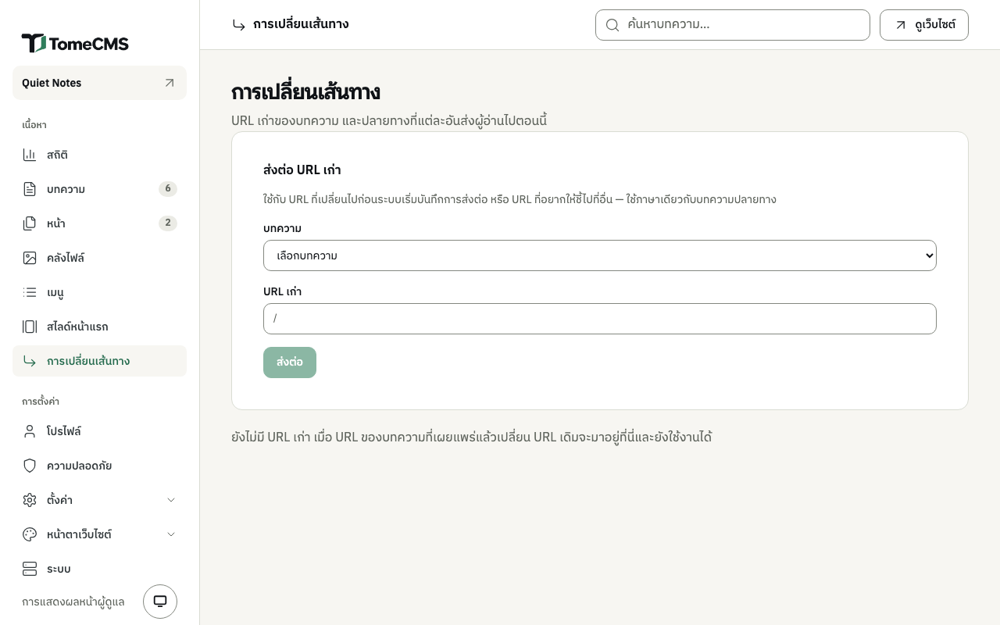

การเผยแพร่คือการนำบทความหรือเพจขึ้นหน้าเว็บสาธารณะ จะขึ้นทันทีหรือตั้งเวลาไว้ก็ได้ แต่ละเรื่องมีที่อยู่ที่สร้างจากชื่อเรื่อง และเมนู "การเปลี่ยนเส้นทาง" ใต้ "เนื้อหา" ทำให้ที่อยู่เก่ายังใช้ได้หลังจากที่อยู่เปลี่ยนไปแล้ว

## เผยแพร่ทันที

ในหน้าแก้ไข กด "เผยแพร่" บทความต้องมีเนื้อหาก่อน ถ้ายังว่างอยู่จะขึ้นว่า "เพิ่มเนื้อหาก่อนเผยแพร่ ตอนนี้ยังไม่มีเนื้อหาเลย"

เมื่อเผยแพร่แล้ว ปุ่มจะเปลี่ยนเป็น "อัปเดต" บทความหรือเพจที่เผยแพร่แล้วไม่มีฉบับร่างแยกต่างหาก การบันทึกของหน้าแก้ไขจะเขียนลงบทความที่อยู่บนเว็บโดยตรง ผู้อ่านจึงเห็นสิ่งที่แก้หลังจากนั้นไม่นาน ถ้าอยากแก้โดยที่ยังไม่มีใครเห็น ให้เอาบทความลงจากเว็บก่อน หรือทำสำเนาแล้วแก้ที่สำเนาแทน

"ยกเลิกเผยแพร่" ในเมนู "..." ข้างบทความในรายการ จะเปลี่ยนบทความกลับเป็นฉบับร่างและเอาลงจากเว็บ ส่วน "เผยแพร่" ในเมนูเดียวกันใช้เผยแพร่ฉบับร่างได้โดยไม่ต้องเปิดหน้าแก้ไข

## ตั้งเวลาเผยแพร่

เปิด "ตั้งค่า" ในหน้าแก้ไข ใส่วันและเวลาในช่อง "เผยแพร่เมื่อ" แล้วกด "เผยแพร่" บทความจะยังไม่ขึ้นเว็บจนถึงเวลานั้น ที่อยู่ของบทความจะตอบ `404` และบทความจะไม่อยู่ในหน้าแรก ในฟีดหรือ sitemap ในหมวดหมู่ ในเมนู หรือใน content API ส่วนในรายการบทความของหน้าแอดมิน บทความจะอยู่ใต้แท็บ "เผยแพร่แล้ว" และมีป้าย "รอเผยแพร่" เมื่อถึงเวลา บทความจะขึ้นเว็บเองโดยไม่ต้องกดอะไรอีก

เวลาในช่อง "เผยแพร่เมื่อ" เป็นเวลาตามเขตเวลาของเครื่องที่คุณใช้อยู่ ส่วนรายการบทความแสดงวันที่ตามเขตเวลาของเว็บ และบอกชื่อเขตเวลาไว้ในวงเล็บข้างวันที่

ตั้งเวลาแล้วต้องกด "เผยแพร่" ในการเปิดหน้าแก้ไขครั้งเดียวกัน ฉบับร่างไม่เก็บวันที่ไว้ ถ้าตั้งเวลาทิ้งไว้ในฉบับร่าง เปิดครั้งหน้าวันที่นั้นจะหายไป ถ้าเว้นช่อง "เผยแพร่เมื่อ" ว่างไว้ จะหมายถึงเผยแพร่ทันที ส่วนวันที่ที่ผ่านไปแล้วจะเผยแพร่บทความทันที โดยลงวันที่ตามที่ใส่ไว้

ถ้าบทความเผยแพร่อยู่แล้ว วันที่ใหม่ในช่อง "เผยแพร่เมื่อ" จะมีผลเมื่อหน้าแก้ไขบันทึกเองครั้งถัดไป ถ้าเป็นวันที่ที่ยังมาไม่ถึง บทความจะลงจากเว็บไปจนถึงเวลานั้น

ในการตั้งค่าของเพจก็มีช่อง "เผยแพร่เมื่อ" แบบเดียวกัน และทำงานเหมือนกัน

## ที่อยู่ของบทความ

บทความอยู่ที่ `/th/blog/` หรือ `/en/blog/` ตามด้วยชื่อใน URL ส่วนเพจอยู่ที่ `/th/` หรือ `/en/` ตามด้วยชื่อใน URL ชื่อใน URL สร้างจากชื่อเรื่องในภาษาของชื่อเรื่องนั้น ชื่อเรื่องภาษาไทยจะได้ที่อยู่เป็นภาษาไทย มีขีดกลางคั่นระหว่างคำ และเบราว์เซอร์จะแสดงเป็นตัวอักษรไทย ถ้าอยากได้ที่อยู่เป็นตัวอักษรละติน ก็พิมพ์เองในช่อง "ชื่อใน URL" ในการตั้งค่าได้

ตอนบันทึก ระบบจะจัดชื่อใน URL ให้เหลือแค่ตัวอักษรละตินพิมพ์เล็ก ตัวเลข อักษรไทย และขีดกลางที่คั่นทีละตัว ถ้าเว้นว่างไว้ ระบบจะสร้างใหม่จากชื่อเรื่อง บทความสองเรื่องในภาษาเดียวกันใช้ที่อยู่ซ้ำกันไม่ได้ เพจสองหน้าก็เช่นกัน ถ้าบันทึกแล้วจะซ้ำ การบันทึกจะไม่สำเร็จจนกว่าคุณจะเปลี่ยนที่อยู่ของเรื่องใดเรื่องหนึ่ง

## เมื่อที่อยู่เปลี่ยน

ถ้าเปลี่ยนชื่อใน URL ของบทความที่เผยแพร่แล้วหรือตั้งเวลาไว้แล้ว ที่อยู่เดิมจะยังใช้ได้ โดยตอบเป็นการส่งต่อแบบถาวร (`301`) ไปยังที่อยู่ปัจจุบันของบทความ ไม่ว่าจะย้ายมาแล้วกี่ครั้ง ลิงก์ที่คนอื่นแชร์ไว้และเครื่องมือค้นหาจึงตามไปถึงบทความได้

การส่งต่อพาผู้อ่านไปถึงบทความได้เฉพาะตอนที่บทความอยู่บนเว็บ ระหว่างที่บทความเป็นฉบับร่างหรือยังไม่ถึงเวลาเผยแพร่ ที่อยู่เดิมจะตอบ `404` เหมือนที่อยู่ใหม่ และเมื่อลบบทความ ที่อยู่เก่าทั้งหมดของบทความนั้นก็หายไปด้วย

## หน้าการเปลี่ยนเส้นทาง

เมนู "การเปลี่ยนเส้นทาง" ใต้ "เนื้อหา" แสดงที่อยู่เก่าทุกอัน บทความที่แต่ละอันพาไป ที่อยู่ปัจจุบันของบทความ และวันที่บันทึกการส่งต่อนั้นไว้ ถ้าบทความไม่ได้อยู่บนเว็บในตอนนั้น จะขึ้นว่า "ยังไม่เผยแพร่ URL นี้จึงตอบ 404 จนกว่าจะเผยแพร่" ปุ่มรูปถังขยะข้างแต่ละแถวใช้เลิกส่งต่อที่อยู่นั้น

ฟอร์ม "ส่งต่อ URL เก่า" ใช้เพิ่มการส่งต่อเอง สำหรับที่อยู่ที่เปลี่ยนไปก่อนระบบเริ่มบันทึกการส่งต่อ หรือที่อยู่ที่อยากให้ชี้ไปที่อื่น

1. ในช่อง "บทความ" เลือกบทความหรือเพจ แต่ละรายการมีภาษากำกับ เช่น `TH · เกี่ยวกับเรา`
2. ในช่อง "URL เก่า" พิมพ์ชื่อใน URL เดิมต่อจาก path ที่ช่องแสดงไว้ เช่น `/th/blog/` ที่อยู่นี้จะนับเป็นภาษาเดียวกับบทความที่เลือก
3. กด "ส่งต่อ"

หน้าแอดมินจะไม่รับที่อยู่ที่บทความของคุณในภาษานั้นใช้อยู่แล้ว (ถ้าเลือกเพจ ก็คือที่อยู่ที่เพจของคุณใช้อยู่) และไม่รับที่อยู่ที่มีอักขระอื่นนอกจากตัวอักษรละตินพิมพ์เล็ก อักษรไทย ตัวเลข และขีดกลางที่คั่นทีละตัว ถ้าที่อยู่เก่านั้นส่งต่อไปที่อื่นอยู่แล้ว จะเปลี่ยนไปชี้ที่บทความที่คุณเลือกแทน
