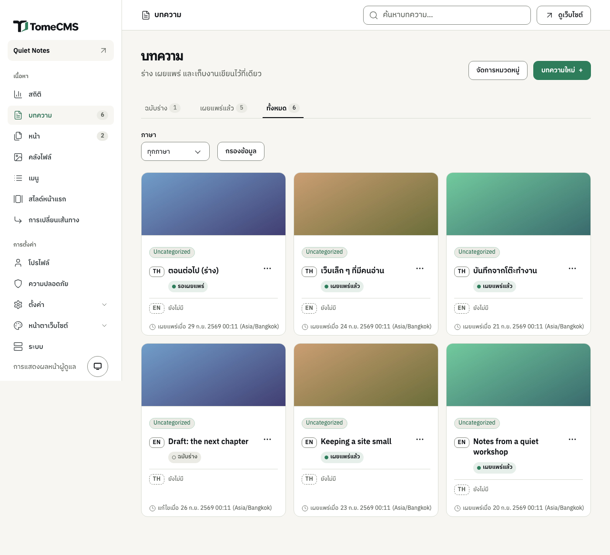

เมนู "บทความ" ใต้ "เนื้อหา" ในหน้าแอดมิน รวมทุกบทความที่คุณเขียนไว้ ส่วนหน้าแก้ไขคือที่ที่ใช้เขียน บทความหนึ่งเรื่องมีได้ทั้งฉบับภาษาไทยและฉบับภาษาอังกฤษ แต่ละฉบับเขียนแยกกัน และรายการบทความจะรวมทั้งสองฉบับไว้ในการ์ดใบเดียว

## หาบทความ

รายการเปิดมาที่แท็บ "ฉบับร่าง" ข้าง ๆ มี "เผยแพร่แล้ว" และ "ทั้งหมด" พร้อมจำนวนของแต่ละแท็บ ช่อง "ภาษา" ใช้กรองให้เหลือเฉพาะ "ไทย" หรือ "อังกฤษ" เมื่อกด "กรองข้อมูล" ส่วนช่อง "ค้นหาบทความ…" ด้านบนของหน้าแอดมินใช้หาบทความจากชื่อเรื่อง

การ์ดหนึ่งใบคือบทความหนึ่งเรื่อง บนการ์ดมีทุกฉบับภาษาที่เขียนไว้พร้อมสถานะ และมีบรรทัด "ยังไม่มี" สำหรับภาษาที่ยังไม่ได้เขียน กดชื่อเรื่องเพื่อเปิดฉบับนั้นในหน้าแก้ไข หรือกด "ยังไม่มี" เพื่อเริ่มเขียนอีกภาษา ปุ่ม "..." ข้างแต่ละฉบับมี "แก้ไข" "ดูตัวอย่าง" "ทำสำเนา" "เผยแพร่" หรือ "ยกเลิกเผยแพร่" และ "ลบ"

"ทำสำเนา" สร้างฉบับร่างใหม่จากฉบับนั้น เป็นภาษาเดียวกัน มี "(สำเนา)" ต่อท้ายชื่อเรื่อง (ฉบับภาษาอังกฤษจะได้ "(copy)") และได้หมวดหมู่ชุดเดียวกัน สำเนานี้เป็นบทความอีกเรื่องหนึ่งต่างหาก และไม่ถูกนับเป็นอีกภาษาของบทความเดิม ส่วน "ลบ" จะลบเฉพาะฉบับภาษานั้น และย้อนกลับไม่ได้

## เริ่มบทความใหม่

กด "บทความใหม่" หน้าแก้ไขจะเปิดขึ้นในภาษาเริ่มต้นของเว็บ พิมพ์ชื่อเรื่องตรงที่มีคำว่า "บทความไม่มีชื่อ" เป็นสีเทา แล้วเขียนเนื้อหาข้างล่าง ตรงที่เขียนว่า "พิมพ์ '/' เพื่อดูคำสั่ง" ชื่อเรื่องยาวได้ไม่เกิน 200 ตัวอักษร

หน้าแก้ไขบันทึกให้เองหลังจากคุณหยุดพิมพ์ได้ครู่หนึ่ง เมื่อบทความมีชื่อเรื่องแล้ว แถบด้านบนจะขึ้นว่า "กำลังบันทึก…" แล้วเป็น "บันทึกแล้ว" ถ้าบันทึกไม่ได้ จะขึ้นว่า "บันทึกไม่สำเร็จ" พร้อมปุ่ม "ลองบันทึกอีกครั้ง" และสิ่งที่เขียนไว้ยังอยู่บนจอครบ ปุ่ม "กลับไปหน้าบทความ" จะบันทึกก่อนออก ถ้าบันทึกไม่ได้ หน้าแอดมินจะถามก่อนด้วยข้อความ "ออกโดยไม่บันทึก?"

"ดูตัวอย่าง" จะบันทึกบทความ แล้วเปิดในแท็บใหม่ตามหน้าตาของธีมที่เว็บใช้อยู่ แม้บทความจะยังเป็นฉบับร่างอยู่ก็ตาม ปุ่มนี้ต้องมีชื่อเรื่องก่อนจึงจะกดได้

## เพิ่มบล็อก

พิมพ์ `/` ที่ต้นบรรทัดหรือหลังเว้นวรรค จะมีเมนูขึ้นมา ได้แก่ "หัวข้อระดับ 2" "หัวข้อระดับ 3" "รายการแบบจุด" "บล็อกโค้ด" "คำพูดอ้างอิง" "ตาราง" และ "ไฟล์" พิมพ์ต่อเพื่อกรองรายการ แล้วกด Enter เพื่อเลือก

ปุ่ม "+" ข้างบรรทัดที่เคอร์เซอร์อยู่ ("เพิ่มบล็อก") เปิดรายการที่ยาวกว่า มี "ข้อความปกติ" "หัวข้อระดับ 1" และ "ภาพ" เพิ่มเข้ามา เลือกด้วยปุ่มลูกศรกับ Enter หรือคลิกก็ได้

ตารางใหม่มีสามแถวสามคอลัมน์ และแถวแรกเป็นหัวตาราง ระหว่างที่เคอร์เซอร์อยู่ในตาราง จะมีแถบที่มุมตารางให้กด "เพิ่มแถว" "เพิ่มคอลัมน์" "ลบแถว" "ลบคอลัมน์" และ "ลบตาราง" คำสั่งชุดเดียวกันนี้ยังขึ้นเป็นกลุ่มแรกในเมนู `/` ด้วย

## จัดรูปแบบข้อความ

เลือกข้อความ แล้วจะมีแถบขึ้นเหนือข้อความนั้น มี "ตัวหนา" "ตัวเอียง" "ลิงก์" และ "โค้ดในบรรทัด" ตามด้วย "ชิดซ้าย" "กึ่งกลาง" และ "ชิดขวา" การจัดแนวมีผลกับทั้งบรรทัด หรือกับช่องในตารางที่เคอร์เซอร์อยู่

"ลิงก์" จะเปิดกล่อง "เพิ่มลิงก์" วางที่อยู่ที่ขึ้นต้นด้วย `http` หรือ `https` ลงในช่อง "ที่อยู่ URL" แล้วกด "ใส่ลิงก์" ตัวเลือก "เปิดในแท็บใหม่" ถูกเลือกไว้ตั้งแต่แรก ถ้าอยากให้ลิงก์เปิดในแท็บเดิมก็ปิดตัวเลือกนี้ จะเอาลิงก์ออก ให้เลือกข้อความที่มีลิงก์แล้วกด "ลิงก์" อีกครั้ง

## ภาพ

เลือก "ภาพ" จากเมนู "+" แล้ว "คลังไฟล์" จะเปิดขึ้นมาให้เลือก กดภาพที่ต้องการเพื่อวางตรงที่เคอร์เซอร์อยู่ หรือกด "อัปโหลดภาพ" เพื่อเพิ่มภาพใหม่แล้ววางลงไปเลย ภาพที่ใส่ด้วยวิธีนี้จะได้ "ข้อความอธิบายภาพ" ที่ตั้งไว้ในคลังไฟล์ติดมาด้วย ถ้าไม่ได้ตั้งไว้จะใช้ชื่อไฟล์แทน

จะลากไฟล์ภาพมาวางบนเนื้อหา หรือคัดลอกภาพมาวางตรง ๆ ก็ได้ ภาพจะขึ้นเป็นสีจาง ๆ ระหว่างที่อัปโหลดเข้าคลังไฟล์ แล้วจึงแสดงเต็มเมื่อเสร็จ คลังไฟล์รับ JPEG, PNG, WebP, GIF และ AVIF ขนาดไม่เกิน 8 MB ไฟล์แบบอื่นจะขึ้นว่า "อัปโหลดภาพไม่สำเร็จ" พร้อมบอกเหตุผล

ภาพที่คัดลอกมาพร้อมข้อความจากเว็บอื่นอาจยังชี้ไปที่อยู่เดิมบนเว็บนั้น แล้วเบราว์เซอร์ของผู้อ่านทุกคนจะไปโหลดภาพจากที่นั่น หน้า[สิ่งที่เบราว์เซอร์ของผู้อ่านเก็บไว้](/tome-cms/th/running/privacy/) อธิบายว่าเว็บนั้นเห็นอะไรบ้าง ทางที่ดีให้อัปโหลดภาพเข้าคลังไฟล์แทน

## ไฟล์

เลือก "ไฟล์" จากเมนู "+" หรือจากเมนู `/` หน้าต่างที่เปิดขึ้นจะแสดงเฉพาะไฟล์ ได้แก่ PDF, Word, Excel, PowerPoint, CSV, ไฟล์ข้อความ และ ZIP ขนาดไม่เกินไฟล์ละ 25 MB กดไฟล์ที่ต้องการ หรือกด "อัปโหลดไฟล์" เพื่อเพิ่มไฟล์ใหม่

ไฟล์จะอยู่ในเนื้อหาเป็นการ์ดที่บอกชื่อ ชนิด และขนาดของไฟล์ ผู้อ่านที่คลิกจะได้ดาวน์โหลดไฟล์ไป ยกเว้น PDF ซึ่งจะเปิดในแท็บใหม่

## การตั้งค่าของบทความ

ปุ่ม "ตั้งค่า" ในแถบด้านบนเปิดแผง "ตั้งค่าบทความ" สิ่งที่แก้ในแผงนี้บันทึกไปพร้อมกับตัวบทความ

| ช่อง | ใช้ทำอะไร |
| --- | --- |
| "ชื่อใน URL" | ที่อยู่ของบทความ ต่อจาก `/th/blog/` หรือ `/en/blog/` ระหว่างที่เขียนบทความใหม่ครั้งแรก ค่านี้จะเปลี่ยนตามชื่อเรื่องจนกว่าคุณจะแก้เอง เมื่อเปิดบทความขึ้นมาแก้อีกครั้ง การเปลี่ยนชื่อเรื่องจะไม่เปลี่ยนค่านี้ ชื่อเรื่องภาษาไทยได้ที่อยู่เป็นภาษาไทย โดยมีขีดกลางคั่นระหว่างคำ |
| "เผยแพร่เมื่อ" | เวลาที่บทความจะขึ้นเว็บ อ่านเพิ่มได้ที่หน้า[การเผยแพร่](/tome-cms/th/admin/publishing/) |
| "หมวดหมู่" | ติ๊กหมวดหมู่ที่บทความนี้อยู่ ถ้าไม่ติ๊กเลย บทความจะอยู่ในหมวดเริ่มต้น ทั้งสองฉบับภาษาใช้หมวดหมู่ชุดเดียวกัน ปุ่ม "จัดการหมวดหมู่" จะบันทึกบทความแล้วพาไปหน้ารายการหมวดหมู่ |
| "ภาพหน้าปก" | ภาพบนการ์ดของบทความและด้านบนของบทความ กด "เลือกภาพ" เพื่อเปิดคลังไฟล์ ขนาดที่เหมาะคือ 1600 × 900 พิกเซลและไม่เกิน 2 MB และรับได้สูงสุด 8 MB |
| "ข้อความย่อ" | อยู่ในกลุ่ม "การ์ดหน้าแรก" เป็นประโยคบนการ์ดของบทความ ยาวไม่เกิน 120 ตัวอักษร ถ้าเว้นว่าง การ์ดจะใช้คำอธิบายสำหรับผลค้นหาแทน แล้วจึงเป็นต้นบทความ |
| "ชื่อสำหรับผลค้นหา" | ชื่อที่ขึ้นในผลการค้นหา ยาวไม่เกิน 70 ตัวอักษร ถ้าเว้นว่างจะใช้ชื่อเรื่องของบทความ |
| "คำอธิบายสำหรับผลค้นหา" | ธีม Paper แสดงไว้ใต้ชื่อบทความ และใช้ในผลการค้นหากับตอนแชร์บทความ ยาวไม่เกิน 320 ตัวอักษร |

## เขียนอีกภาษา

ป้ายในแถบด้านบนบอกแต่ละภาษาและสถานะของฉบับนั้น เช่น "EN เผยแพร่แล้ว" และ "TH ยังไม่มี" กดป้ายของอีกภาษา หน้าแอดมินจะบันทึกฉบับที่เปิดอยู่ แล้วเปิดฉบับนั้นขึ้นมา ฉบับใหม่เริ่มจากหน้าว่าง แต่ได้ภาพหน้าปกและหมวดหมู่ของฉบับเดิมมาด้วย ฉบับนี้มีชื่อเรื่อง ที่อยู่ และการตั้งค่าของตัวเอง และเผยแพร่แยกกัน

บรรทัด "ยังไม่มี" บนการ์ดของบทความในรายการก็ทำแบบเดียวกัน

## ให้ระบบช่วยเสนอระหว่างเขียน

ถ้าเปิดปลั๊กอิน "Jev (TypeSafe AI)" ไว้ในหน้า "ปลั๊กอิน" ใต้ "หน้าตาเว็บไซต์" แผงตั้งค่าจะมีปุ่มเพิ่มมาสามปุ่ม "เสนอจากเนื้อหา" เสนอหมวดหมู่จากหมวดที่คุณมีอยู่แล้ว "เสนอประโยคจากเนื้อหา" หยิบประโยคจากบทความมาเสนอเป็นข้อความย่อ และ "เสนอคำอธิบายจากเนื้อหา" หยิบมาเสนอเป็นคำอธิบายสำหรับผลค้นหา

ระบบไม่กรอกอะไรให้เอง หมวดหมู่ที่เสนอมาเป็นป้ายที่คุณต้องกดเองจึงจะเพิ่ม ส่วนประโยคที่เสนอมาจะมีปุ่ม "ใช้ประโยคนี้" หรือ "ใช้เป็นคำอธิบาย" ให้กดเอง เนื้อหาของบทความจะถูกส่งไปที่ TypeSafe AI เฉพาะตอนที่คุณกดหนึ่งในสามปุ่มนี้เท่านั้น ถ้าไม่ได้เปิดปลั๊กอิน ปุ่มเหล่านี้จะไม่มีให้เห็น

หน้าแก้ไขเพจใช้งานแบบเดียวกัน ส่วนที่ต่างออกไปอยู่ในหน้า[หน้าและเมนู](/tome-cms/th/admin/pages-and-menus/)
